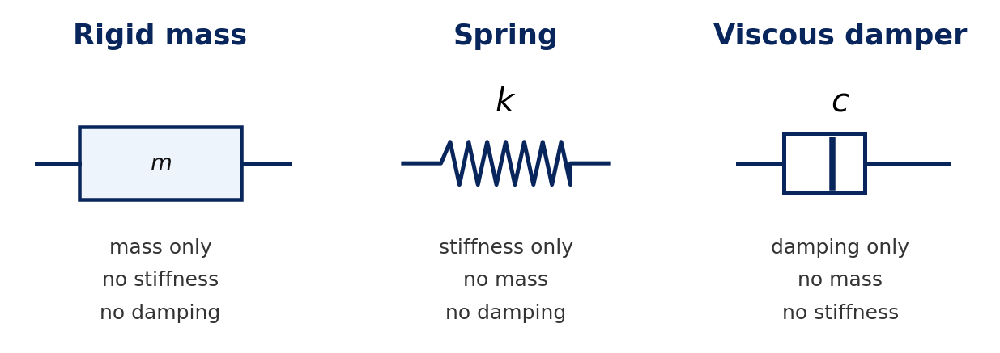
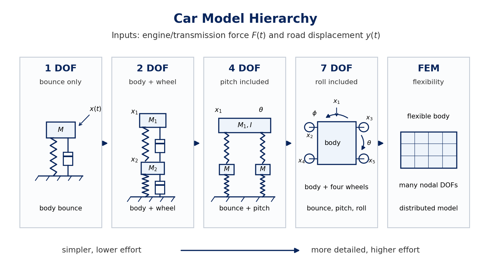

# Physics vs. Data

This lecture introduces lumped-parameter vibration models and compares physics-based modal analysis with data-driven approaches.

**Core ideas**

- A single physical system can have several useful models.
- The chosen model depends on the study objective and required accuracy.
- Vibration is governed mainly by mass, stiffness, and damping.

## Modal Analysis Routes

| Approach | Short form | Starts from | Identifies / produces |
| --- | --- | --- | --- |
| Analytical modal analysis | AMA | mathematical model | modal properties and response |
| Experimental modal analysis | EMA | measured FRFs or IRFs | natural frequencies, mode shapes, damping factors |
| Operational modal analysis | OMA | measured output response during operation or ambient excitation | natural frequencies, mode shapes, damping factors |

The measured functions or responses are used to identify:

- **Natural frequencies:** frequencies at which the system tends to vibrate freely.
- **Mode shapes:** relative deformation patterns at those frequencies.
- **Damping factors/ratios:** measures of how quickly vibration energy is dissipated.

What are FRFs and IRFs?

**Frequency response function (FRF):** response per unit harmonic force as frequency changes. For response at coordinate $i$ due to force at coordinate $j$:

$$
H_{ij}(\omega)=\frac{X_i(\omega)}{F_j(\omega)}
$$

An FRF gives both amplitude and phase.

**Impulse response function (IRF):** time response after a very short impulse force, such as a hammer impact.

FRFs and IRFs contain equivalent dynamic information:

- FRF: response versus frequency.
- IRF: response versus time.
- They are related by the Fourier transform.

## Three Equivalent Models

A vibratory system can be represented in three equivalent forms.

| Model | Describes the system using | Typical use |
| --- | --- | --- |
| Spatial model | $\mathbf{M}$, $\mathbf{C}$, $\mathbf{K}$ | analytical modeling |
| Response model | FRFs or IRFs | measured dynamic response |
| Modal model | $\omega_r$, $\boldsymbol{\phi}_r$, $\zeta_r$ | compact modal description |

Model definitions

**Spatial model**

$$
\mathbf{M}\ddot{\mathbf{x}}(t)
+ \mathbf{C}\dot{\mathbf{x}}(t)
+ \mathbf{K}\mathbf{x}(t)
= \mathbf{f}(t)
$$

This is the usual starting point for analytical modal analysis.

**Response model**

FRFs or IRFs describe how the system responds dynamically. For an FRF, $H_{ij}(\omega)$ means response at coordinate $i$ due to force at coordinate $j$.

**Modal model**

$$
\omega_r,\quad \boldsymbol{\phi}_r,\quad \zeta_r
$$

where $\omega_r$ is the $r$-th natural frequency, $\boldsymbol{\phi}_r$ is the $r$-th mode shape, and $\zeta_r$ is the $r$-th damping factor or damping ratio.

## Analytical Model Types

| Model type | Form | Best suited for |
| --- | --- | --- |
| Continuous model | partial differential equations | simple geometry, boundary conditions, and material properties |
| Lumped-parameter model | discrete masses, springs, dampers | simple physical idealization |
| Finite element model | systematic discretization | complex structures |

What is FEM?

Finite element modeling divides a continuous body into many small elements. Spatial coordinates such as $x$, $y$, and $z$ are discretized, leaving ordinary differential equations in time:

$$
\mathbf{M}\ddot{\mathbf{x}}(t)
+
\mathbf{C}\dot{\mathbf{x}}(t)
+
\mathbf{K}\mathbf{x}(t)
=
\mathbf{f}(t)
$$

Thus FEM produces the same kind of spatial model used in modal analysis: mass, damping, and stiffness matrices.

## Lumped Parameter Modeling

A lumped-parameter model uses ideal discrete elements. The modeling question is:

> Which physical properties affect vibration?

Answer: **mass, stiffness, and damping**.

| Property | Ideal element | Meaning | Energy / force form |
| --- | --- | --- | --- |
| inertia | rigid mass | stores translational kinetic energy | $T=\frac{1}{2}m\dot{x}^2$ |
| rotational inertia | mass moment of inertia | stores rotational kinetic energy | $T=\frac{1}{2}J\dot{\theta}^2$ |
| elasticity | spring | stores strain energy | $U=\frac{1}{2}kx^2$ |
| torsional elasticity | torsional spring | stores rotational strain energy | $U=\frac{1}{2}k_t\theta^2$ |
| dissipation | viscous damper | represents energy loss | $f_d=c\dot{x}$ |
| torsional dissipation | torsional damper | rotational damping torque | $T_d=c_t\dot{\theta}$ |

Ideal lumped element diagram

Real components mix properties. A physical spring, for example, also has mass and damping. Lumped modeling separates these effects for analysis. Temperature and similar effects enter indirectly when they change stiffness or damping.

## Basic Equations

Example 1: SDOF translational model

For mass $m$, damping $c$, stiffness $k$, displacement $x(t)$, and force $f(t)$:

$$
m\ddot{x}(t)+c\dot{x}(t)+kx(t)=f(t)
$$

Free undamped vibration:

$$
m\ddot{x}(t)+kx(t)=0
$$

Natural frequency:

$$
\omega_n=\sqrt{\frac{k}{m}}
$$

Example 2: base-excited SDOF model

For road input $y(t)$, body displacement $x(t)$, and applied force $F(t)$:

$$
m\ddot{x}
+c(\dot{x}-\dot{y})
+k(x-y)
=F(t)
$$

Example 3: multi-degree-of-freedom model

Generalized coordinates:

$$
\mathbf{x}(t)=
\begin{bmatrix}
x_1(t)\\
x_2(t)\\
\vdots\\
x_n(t)
\end{bmatrix}
$$

Standard equation:

$$
\mathbf{M}\ddot{\mathbf{x}}(t)
+\mathbf{C}\dot{\mathbf{x}}(t)
+\mathbf{K}\mathbf{x}(t)
=\mathbf{f}(t)
$$

Undamped free vibration:

$$
\mathbf{M}\ddot{\mathbf{x}}+\mathbf{K}\mathbf{x}=\mathbf{0}
$$

Assume harmonic motion:

$$
\mathbf{x}(t)=\boldsymbol{\phi}e^{i\omega t}
$$

Eigenvalue problem:

$$
\left(\mathbf{K}-\omega^2\mathbf{M}\right)\boldsymbol{\phi}=\mathbf{0}
$$

Non-trivial mode shapes require:

$$
\det\left(\mathbf{K}-\omega^2\mathbf{M}\right)=0
$$

Example 4: torsional model

$$
J\ddot{\theta}(t)+c_t\dot{\theta}(t)+k_t\theta(t)=T(t)
$$

where $J$ is polar mass moment of inertia, $c_t$ is torsional damping, $k_t$ is torsional stiffness, and $T(t)$ is applied torque.

## Modeling Complexity

As the model represents the physical system more closely, accuracy usually improves, but computational effort also increases:

$$
\text{higher model accuracy}
\quad \Longleftrightarrow \quad
\text{higher computational effort}
$$

A model is not unique: the structure is unique, but the model depends on purpose and required accuracy.

Example: compact car model hierarchy

A car on a rough road can be modeled at different levels. Typical inputs are engine/transmission force $F(t)$ and road displacement $y(t)$.

| Model | Main purpose | Coordinates kept |
| --- | --- | --- |
| 1 DOF | body bouncing only | vertical body motion $x(t)$ |
| 2 DOF | body and wheel/tire motion | $x_1(t), x_2(t)$ |
| 4 DOF | bouncing plus pitching | body bounce, front/rear wheel motion, pitch $\theta(t)$ |
| 7 DOF | bouncing, pitching, and rolling | body bounce, pitch $\theta(t)$, roll $\phi(t)$, four wheel motions |
| finite element model | body flexibility and detailed structure | many distributed DOFs |

## Applications of Data-Driven Modal Analysis

OMA and EMA allow:

- troubleshoot vibration and noise problems,
- avoid resonant operation,
- validate analytical models,
- simulate response to dynamic forces,
- identify unknown operational forces,
- perform coupled structural analysis and update uncertain model parameters,
- monitor structural health and detect damage.
