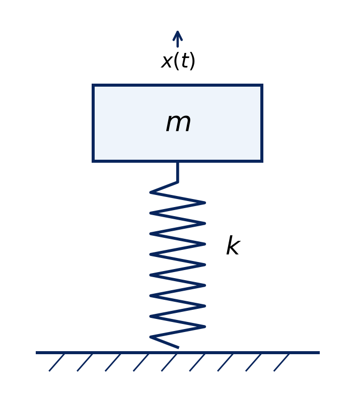
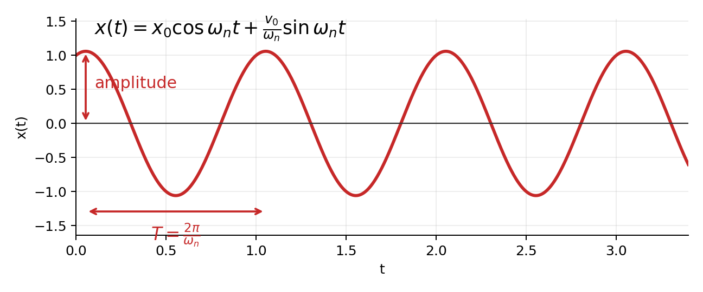
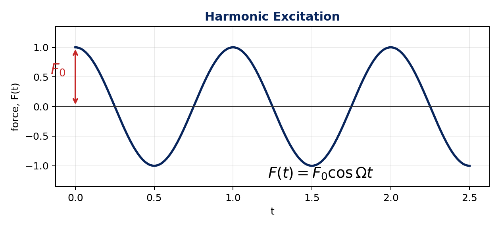
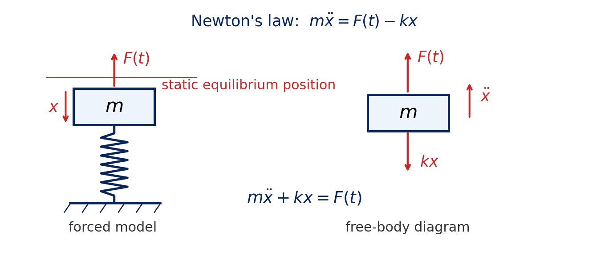
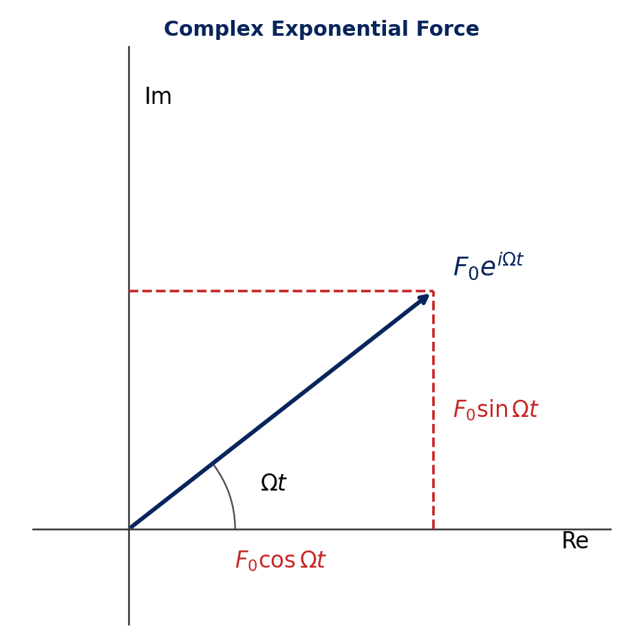
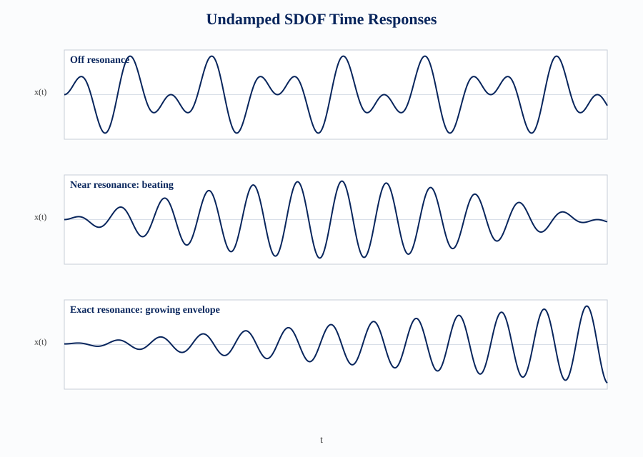
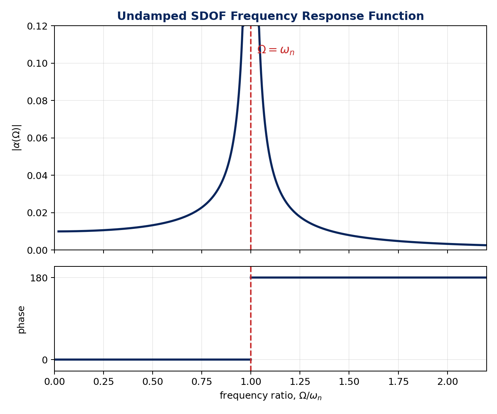

# Undamped SDOF Equations

An undamped single-degree-of-freedom (SDOF) lumped model is used here to study free vibration, harmonic forced vibration, resonance, and the frequency response function.

**Core ideas**

- A physical mass-spring model becomes a mathematical model by applying a physical law.
- Undamped models are idealizations, but they predict natural frequencies, which strongly shape dynamic behavior.
- Newton's law is used here; energy, virtual work, Lagrange's equations, and Hamilton's principle are useful when force balance becomes tedious.

SDOF, MDOF, and undamped systems

| Term | Meaning |
| --- | --- |
| SDOF system | Dynamics can be approximated by one coordinate for the study objective. |
| MDOF system | More than one coordinate is needed for the study objective. |
| Undamped system | Damping is neglected; no energy is dissipated in the model. |

Example: a car may be SDOF for body bounce only, but needs more DOFs for pitch, roll, wheel motion, or body flexibility.

Figure: undamped SDOF mass-spring model

## Free Vibration

Free vibration is caused by an initial disturbance, with no continuously acting external force.

For mass $m$, stiffness $k$, and displacement $x(t)$ measured from static equilibrium:

$$
m\ddot{x}+kx=0
$$

or:

$$
\ddot{x}+\frac{k}{m}x=0
$$

Since:

$$
\ddot{x}=-\frac{k}{m}x
$$

acceleration is proportional to displacement and opposite in direction, so the motion is simple harmonic.

The undamped natural frequency is:

$$
\omega_n=\sqrt{\frac{k}{m}}
$$

Frequency in cycles per second and natural period:

$$
f_n=\frac{\omega_n}{2\pi},
\qquad
\tau_n=\frac{2\pi}{\omega_n}
$$

For $x(0)=x_0$ and $\dot{x}(0)=v_0$:

$$
x(t)=x_0\cos \omega_n t+\frac{v_0}{\omega_n}\sin \omega_n t
$$

Equivalent amplitude-phase form:

$$
x(t)=X\cos(\omega_n t-\phi)
$$

where:

$$
X=\sqrt{x_0^2+\left(\frac{v_0}{\omega_n}\right)^2},
\qquad
\tan\phi=\frac{v_0/\omega_n}{x_0}
$$

Interpretation:

- the amplitude is constant because damping is neglected,
- the motion occurs at $\omega_n$,
- two initial conditions are needed because the equation is second order,
- real systems need damping to predict decay.

Figure: free-vibration amplitude and period

Derivation: gravity cancellation

For a vertical spring-mass system, gravity causes static deflection $\delta$:

$$
k\delta=mg
$$

If motion is measured from static equilibrium, Newton's law gives:

$$
m\ddot{x}=-k(x+\delta)+mg
$$

Using $k\delta=mg$:

$$
m\ddot{x}+kx=0
$$

Thus gravity does not appear in the final spring-mass equation when displacement is measured from static equilibrium. Gravity can still appear in systems such as the simple pendulum, where it provides the restoring effect.

Derivation: free-response constants

Assume:

$$
x(t)=A\cos\omega t+B\sin\omega t
$$

Substitution into $m\ddot{x}+kx=0$ gives:

$$
(k-m\omega^2)(A\cos\omega t+B\sin\omega t)=0
$$

For non-zero motion:

$$
\omega=\omega_n=\sqrt{\frac{k}{m}}
$$

So:

$$
x(t)=A\cos\omega_n t+B\sin\omega_n t
$$

Initial conditions give:

$$
A=x_0,
\qquad
B=\frac{v_0}{\omega_n}
$$

Derivation: amplitude-phase constants

Start from:

$$
x(t)=x_0\cos\omega_n t+\frac{v_0}{\omega_n}\sin\omega_n t
$$

Compare with:

$$
x(t)=X\cos(\omega_n t-\phi)
$$

Using $\cos(a-b)=\cos a\cos b+\sin a\sin b$:

$$
X\cos(\omega_n t-\phi)
=X\cos\phi\cos\omega_n t+X\sin\phi\sin\omega_n t
$$

Match coefficients:

$$
X\cos\phi=x_0,
\qquad
X\sin\phi=\frac{v_0}{\omega_n}
$$

Then:

$$
X^2=x_0^2+\left(\frac{v_0}{\omega_n}\right)^2,
\qquad
\tan\phi=\frac{v_0/\omega_n}{x_0}
$$

## Harmonic Forced Vibration

Forced vibration is vibration due to a continuously acting external dynamic force. For harmonic excitation:

$$
F(t)=F_0\cos\Omega t
$$

where $F_0$ is the force amplitude and $\Omega$ is the forcing frequency. Examples include rotating machinery, rotor unbalance, and other periodic forces.

The equation of motion is:

$$
m\ddot{x}+kx=F(t)
$$

When $x(t)$ is measured from static equilibrium, gravity and static spring force are already balanced.

Figure: harmonic excitation

Figure: forced model and free-body diagram

For $F(t)=F_0\cos\Omega t$, write:

$$
x(t)=x_c(t)+x_p(t)
$$

The complementary part solves the homogeneous equation:

$$
m\ddot{x}+kx=0
$$

so:

$$
x_c(t)=A\cos\omega_n t+B\sin\omega_n t
$$

Away from resonance, the particular part is:

$$
x_p(t)=\frac{F_0}{k-m\Omega^2}\cos\Omega t
$$

The complete response is:

$$
x(t)=A\cos\omega_n t+B\sin\omega_n t+
\frac{F_0}{k-m\Omega^2}\cos\Omega t
$$

The complementary part occurs at the natural frequency and is the part that becomes transient when damping is included. The particular part occurs at the forcing frequency and is the steady-state part.

Derivation: direct particular solution

Assume the particular response has the same frequency as the harmonic force:

$$
x_p(t)=X_0\cos\Omega t
$$

Then:

$$
\ddot{x}_p(t)=-\Omega^2X_0\cos\Omega t
$$

Substitute into $m\ddot{x}+kx=F_0\cos\Omega t$:

$$
-m\Omega^2X_0\cos\Omega t+kX_0\cos\Omega t=F_0\cos\Omega t
$$

Therefore:

$$
X_0=\frac{F_0}{k-m\Omega^2}
$$

Using $x_{\mathrm{st}}=F_0/k$ and $\omega_n^2=k/m$:

$$
X_0=
\frac{x_{\mathrm{st}}}{1-\left(\frac{\Omega}{\omega_n}\right)^2}
$$

Alternative derivation: complex exponential method

Use the complex force:

$$
\bar{F}(t)=F_0e^{i\Omega t}
$$

The physical force is:

$$
F(t)=\operatorname{Re}\{\bar{F}(t)\}
$$

Euler's identity gives:

$$
F_0e^{i\Omega t}=F_0\cos\Omega t+iF_0\sin\Omega t
$$

So the complex force is a rotating vector in the complex plane.

Figure: complex exponential force

Assume:

$$
\bar{x}_p(t)=\bar{X}_{p0}e^{i\Omega t}
$$

Differentiation becomes algebraic:

$$
\dot{\bar{x}}_p=i\Omega\bar{x}_p,
\qquad
\ddot{\bar{x}}_p=-\Omega^2\bar{x}_p
$$

Substitution gives:

$$
(k-m\Omega^2)\bar{X}_{p0}=F_0
$$

therefore:

$$
\bar{X}_{p0}=\frac{F_0}{k-m\Omega^2}
$$

The physical particular response is the real part:

$$
x_p(t)=\operatorname{Re}\{\bar{x}_p(t)\}
=\frac{F_0}{k-m\Omega^2}\cos\Omega t
$$

The method is useful because differentiating or integrating $e^{i\Omega t}$ only multiplies or divides by $i\Omega$.

## Resonance and Dynamic Amplification

Static deflection is the displacement produced by applying the force amplitude $F_0$ slowly:

$$
x_{\mathrm{st}}=\delta=\frac{F_0}{k}
$$

Frequency ratio:

$$
r=\frac{\Omega}{\omega_n}
$$

The forced-response amplitude can be written as:

$$
X_0=\frac{F_0}{k-m\Omega^2}
=\frac{x_{\mathrm{st}}}{1-r^2}
$$

Here $x_{\mathrm{st}}$ is frequency independent; the frequency dependence is in $1/(1-r^2)$.

The dynamic amplification factor is:

$$
\frac{X_0}{x_{\mathrm{st}}}=\frac{1}{1-r^2}
$$

Useful limits:

$$
\Omega=0 \Rightarrow X_0=x_{\mathrm{st}},
\qquad
\Omega\to\omega_n \Rightarrow X_0\to\infty
$$

Resonance limit for zero initial conditions

For $x(0)=0$ and $\dot{x}(0)=0$, the constants in the complementary part give:

$$
x(t)=
\frac{x_{\mathrm{st}}}{1-\left(\frac{\Omega}{\omega_n}\right)^2}
\left(\cos\Omega t-\cos\omega_n t\right)
$$

At resonance this has the indeterminate form $0/0$, so use L'Hospital's rule with respect to $\Omega$:

$$
\lim_{\Omega\to\omega_n}x(t)
=x_{\mathrm{st}}
\lim_{\Omega\to\omega_n}
\frac{-t\sin\Omega t}
{-2\Omega/\omega_n^2}
$$

Therefore:

$$
\lim_{\Omega\to\omega_n}x(t)
=\frac{1}{2}t\omega_n x_{\mathrm{st}}\sin\omega_n t
$$

The oscillation amplitude grows linearly with time in the ideal undamped model. Real systems do not grow without bound because damping limits the response.

Figure: undamped SDOF time responses

## Frequency Response Function

The frequency response function, FRF, is the ratio of steady-state response amplitude to force amplitude at frequency $\Omega$:

$$
H(\Omega)=\frac{X(\Omega)}{F(\Omega)}
$$

For displacement response, the FRF is also called receptance:

$$
\alpha(\Omega)=\frac{X(\Omega)}{F(\Omega)}
$$

For the undamped SDOF system:

$$
H(\Omega)=\alpha(\Omega)=\frac{1}{k-m\Omega^2}
=\frac{1/k}{1-\left(\frac{\Omega}{\omega_n}\right)^2}
$$

| Frequency range | FRF behavior | Meaning |
| --- | --- | --- |
| $\Omega=0$ | $H(0)=1/k$ | static flexibility |
| $\Omega<\omega_n$ | positive real value, phase $0^\circ$ | stiffness-controlled |
| $\Omega=\omega_n$ | unbounded in ideal undamped model | resonance |
| $\Omega>\omega_n$ | negative real value, phase $180^\circ$ | mass-controlled |
| very high $\Omega$ | $H(\Omega)\approx -1/(m\Omega^2)$ | inertia dominates |

Because damping is neglected, the FRF is real except at the singularity. Damped systems have finite resonance peaks and smooth phase variation through resonance.

Magnitude and phase of the undamped FRF

Magnitude:

$$
|H(\Omega)|=\frac{1}{|k-m\Omega^2|}
$$

Phase:

$$
\angle H(\Omega)=
\begin{cases}
0^\circ, & \Omega<\omega_n\\
\text{undefined}, & \Omega=\omega_n\\
180^\circ, & \Omega>\omega_n
\end{cases}
$$

Equivalently:

$$
x_p(t)=|H(\Omega)|F_0\cos\left(\Omega t-\phi\right)
$$

with $\phi=0^\circ$ below resonance and $\phi=180^\circ$ above resonance.

Here $m$, $k$, and $\Omega$ are real, so the undamped FRF has no imaginary part. The phase is extracted from the sign of $H(\Omega)$: a positive real value gives $0^\circ$, and a negative real value is equivalent to a $180^\circ$ phase shift because:

$$
-\cos\Omega t=\cos(\Omega t-180^\circ)
$$

Figure: undamped SDOF receptance

