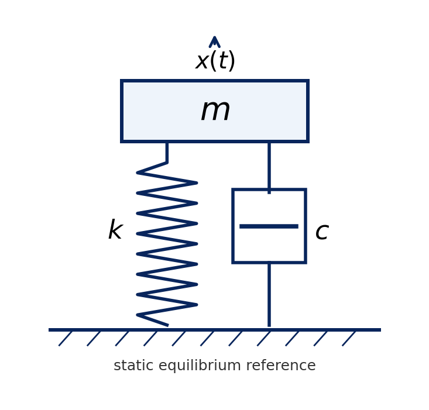
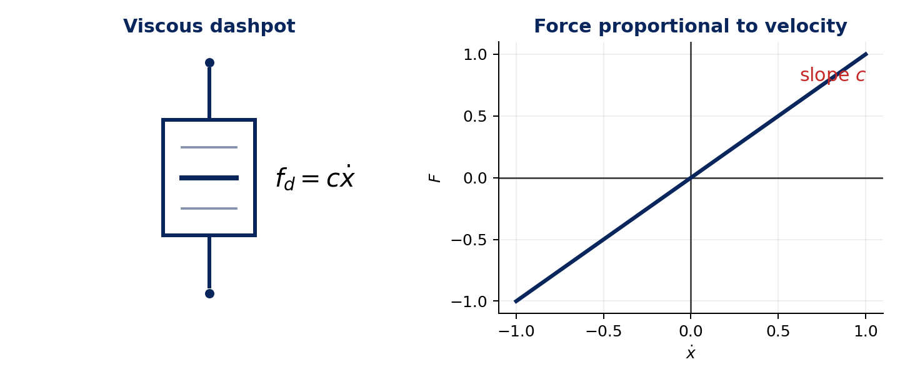
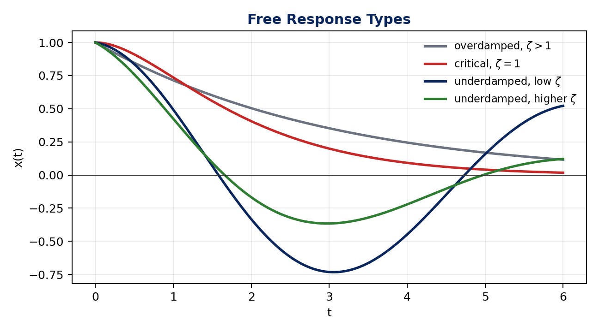
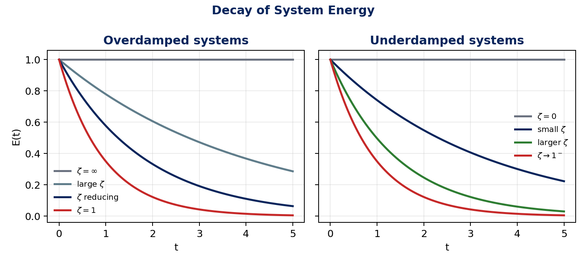
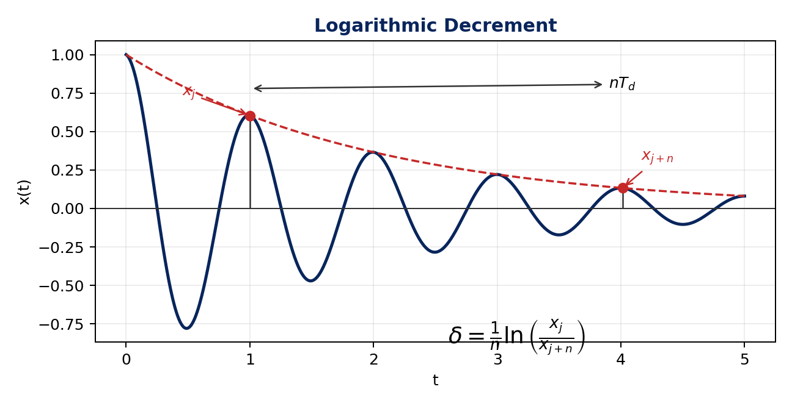
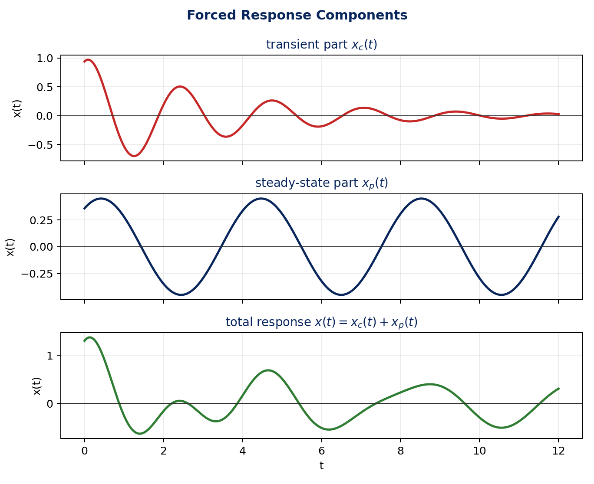
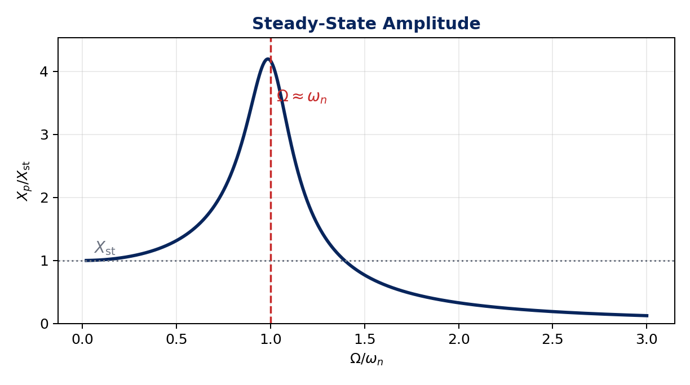
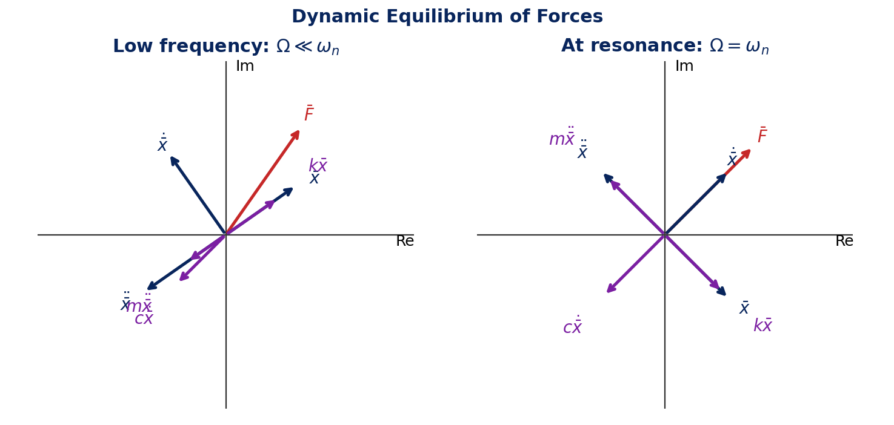
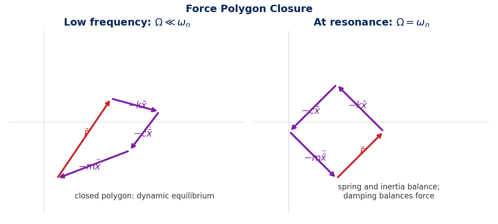

# Viscously Damped SDOF Systems

Real systems dissipate energy during vibration, so damping changes both free and forced response. This lecture studies an SDOF model with mass $m$, viscous damping coefficient $c$, stiffness $k$, and displacement $x(t)$ measured from static equilibrium.

$$
m,\quad c,\quad k,\quad x(t)
$$

**Core ideas**

- Damping means dissipation of vibration energy.
- A viscous damper is a convenient model even when the real mechanism is more complicated.
- The damping ratio $\zeta=c/c_c$ classifies the free response.
- In forced vibration, the transient part decays and the steady-state part remains.
- At resonance, damping controls the maximum response.

Figure: damped SDOF physical model

## Damping Model

Damping is energy loss from the vibrating system.

| Source | Common name / note |
| --- | --- |
| viscous friction from fluids or gases | viscous damping |
| dry friction | Coulomb damping |
| hysteresis effects in material/structure | structural damping |
| internal mechanisms in the body | internal damping mechanisms |
| sound radiation from a vibrating body | acoustic damping |

For a viscous dashpot, the resistive force is proportional to relative velocity:

$$
f_d=c\dot{x}
$$

The damping coefficient has units:

$$
\mathrm{N\,s/m}
\quad\text{or}\quad
\frac{\mathrm{N}}{\mathrm{m/s}}
$$

The damping force acts opposite to velocity.

Figure: viscous dashpot and force-velocity law

## Free Vibration

For free vibration, no continuing external force acts on the system. Newton's law gives:

$$
m\ddot{x}+c\dot{x}+kx=0
$$

Equivalently, the free-body balance is:

$$
m\ddot{x}=-kx-c\dot{x}
$$

Because acceleration is no longer proportional only to displacement, the motion is not simple harmonic. The response must include decay.

Assume:

$$
x(t)=Ae^{st}
$$

This gives the characteristic equation:

$$
ms^2+cs+k=0
$$

Define the undamped natural frequency $\omega_n$, critical damping coefficient $c_c$ (the boundary between non-oscillatory and oscillatory free response), and damping ratio $\zeta$:

$$
\omega_n=\sqrt{\frac{k}{m}},
\qquad
c_c=2\sqrt{km}=2m\omega_n,
\qquad
\zeta=\frac{c}{c_c}
$$

The roots are:

$$
s_{1,2}=
\left(-\zeta\pm\sqrt{\zeta^2-1}\right)\omega_n
$$

The response type depends on $\zeta$: overdamped means $\zeta>1$, critically damped means $\zeta=1$, and underdamped means $\zeta<1$.

| Case | Roots | Response | Main behavior |
| --- | --- | --- | --- |
| $\zeta>1$ overdamped | real, unequal | $x(t)=A_1e^{s_1t}+A_2e^{s_2t}$ | exponential decay, no oscillation, may cross equilibrium at most once |
| $\zeta=1$ critically damped | real, equal, $s_1=s_2=-\omega_n$ | $x(t)=(A_1+A_2t)e^{-\omega_n t}$ | fastest non-oscillatory return, approaches zero asymptotically |
| $\zeta<1$ underdamped | complex conjugates | $x(t)=Ae^{-\zeta\omega_n t}\cos(\omega_d t-\phi)$ | decaying oscillation |

For the underdamped case:

$$
s_{1,2}=-\zeta\omega_n\pm i\omega_d,
\qquad
\omega_d=\omega_n\sqrt{1-\zeta^2}
$$

Interpretation:

| Term | Meaning |
| --- | --- |
| $Ae^{-\zeta\omega_n t}$ | exponentially decaying amplitude envelope |
| $\omega_d$ | damped natural frequency |
| $\phi$ | phase lag set by initial conditions |

Increasing $\zeta$ within $0<\zeta<1$ makes the amplitude decay faster. If $\zeta=0$, the oscillation continues with constant amplitude.

Figure: free-response cases for different damping levels

Derivation: damped free-vibration roots

Start with:

$$
m\ddot{x}+c\dot{x}+kx=0
$$

Assume:

$$
x(t)=Ae^{st}
$$

Then:

$$
\dot{x}=sAe^{st},
\qquad
\ddot{x}=s^2Ae^{st}
$$

Substitution gives:

$$
(ms^2+cs+k)Ae^{st}=0
$$

For non-zero motion:

$$
ms^2+cs+k=0
$$

Thus:

$$
s_{1,2}=\frac{-c\pm\sqrt{c^2-4mk}}{2m}
$$

The transition between root types occurs when:

$$
c^2=4mk
$$

so:

$$
c_c=2\sqrt{mk}
$$

Using $\zeta=c/c_c$ and $\omega_n=\sqrt{k/m}$:

$$
\frac{c}{2m}=\zeta\omega_n
$$

and:

$$
s_{1,2}=
\left(-\zeta\pm\sqrt{\zeta^2-1}\right)\omega_n
$$

Derivation: underdamped real response

For $\zeta<1$:

$$
s_{1,2}=-\zeta\omega_n\pm i\omega_n\sqrt{1-\zeta^2}
$$

Let:

$$
\omega_d=\omega_n\sqrt{1-\zeta^2}
$$

The exponential solution is:

$$
x(t)=A_1e^{(-\zeta\omega_n+i\omega_d)t}
+A_2e^{(-\zeta\omega_n-i\omega_d)t}
$$

Factor out the decay:

$$
x(t)=e^{-\zeta\omega_n t}
\left(A_1e^{i\omega_d t}+A_2e^{-i\omega_d t}\right)
$$

Using Euler's identity, the real response can be written as:

$$
x(t)=e^{-\zeta\omega_n t}
\left(B\cos\omega_d t+D\sin\omega_d t\right)
$$

or:

$$
x(t)=Ae^{-\zeta\omega_n t}\cos(\omega_d t-\phi)
$$

The constants $A$ and $\phi$ are found from initial displacement and initial velocity.

## Energy Decay and Logarithmic Decrement

The total mechanical energy is:

$$
E(t)=\frac{1}{2}m\dot{x}^2+\frac{1}{2}kx^2
$$

Damping dissipates energy, so $E(t)$ decays with time.

Important observation: more damping does not always mean faster decay. Power dissipation depends on both damping force and velocity.

| Damping range | Energy-decay behavior |
| --- | --- |
| $\zeta=0$ | total energy stays constant |
| $0<\zeta<1$ | increasing $\zeta$ increases decay rate |
| $\zeta>1$ | decreasing $\zeta$ toward $1$ increases decay rate |
| $\zeta=1$ | fastest return / highest energy-decay rate |

Figure: qualitative decay of system energy

For an underdamped free response, the logarithmic decrement $\delta$ is a natural-log measure of peak-amplitude decay. It relates the decay of peak amplitudes to damping ratio. If $x_j$ is a peak and $x_{j+n}$ is the peak after $n$ cycles:

$$
\delta=\frac{1}{n}\ln\left(\frac{x_j}{x_{j+n}}\right)
$$

For viscous damping:

$$
\delta=
\frac{2\pi\zeta}{\sqrt{1-\zeta^2}}
$$

For one cycle:

$$
\delta=\ln\left(\frac{x_j}{x_{j+1}}\right)
$$

This is practically useful: measured free-decay peaks can be used to estimate $\zeta$.

Figure: logarithmic decrement from successive peaks

Derivation: logarithmic decrement

For underdamped free vibration:

$$
x(t)=Ae^{-\zeta\omega_n t}\cos(\omega_d t-\phi)
$$

At corresponding peaks separated by $n$ cycles:

$$
t_{j+n}=t_j+nT_d,
\qquad
T_d=\frac{2\pi}{\omega_d}
$$

Since the cosine factor repeats at corresponding peaks, the amplitude ratio is governed by the exponential envelope:

$$
\frac{x_j}{x_{j+n}}
=
\frac{Ae^{-\zeta\omega_n t_j}}
{Ae^{-\zeta\omega_n(t_j+nT_d)}}
$$

Therefore:

$$
\frac{x_j}{x_{j+n}}
=e^{\zeta\omega_n nT_d}
$$

Substitute $T_d=2\pi/\omega_d$ and $\omega_d=\omega_n\sqrt{1-\zeta^2}$:

$$
\frac{x_j}{x_{j+n}}
=
e^{\frac{2\pi\zeta n}{\sqrt{1-\zeta^2}}}
$$

Taking the natural logarithm:

$$
\frac{1}{n}\ln\left(\frac{x_j}{x_{j+n}}\right)
=
\frac{2\pi\zeta}{\sqrt{1-\zeta^2}}
$$

## Harmonic Forced Vibration

For harmonic forcing:

$$
F(t)=F_0\cos\Omega t
$$

The equation of motion is:

$$
m\ddot{x}+c\dot{x}+kx=F_0\cos\Omega t
$$

The total response is:

$$
x(t)=x_c(t)+x_p(t)
$$

For an underdamped system:

$$
x_c(t)=Ae^{-\zeta\omega_n t}\cos(\omega_d t-\phi)
$$

This is the transient response, meaning the complementary part that dies out with time.

The particular response is the steady-state response, meaning the part left after the transient decays:

$$
x_p(t)=X_p\cos(\Omega t-\psi)
$$

where:

$$
X_p=
\frac{X_{\mathrm{st}}}
{\sqrt{(1-r^2)^2+(2\zeta r)^2}},
\qquad
X_{\mathrm{st}}=\frac{F_0}{k},
\qquad
r=\frac{\Omega}{\omega_n}
$$

The phase lag is:

$$
\psi=\tan^{-1}\left(\frac{2\zeta r}{1-r^2}\right)
$$

Use the quadrant-correct phase in practice because the denominator changes sign when $r>1$.

The lecture writes the total underdamped response as:

$$
x(t)=
Ae^{-\zeta\omega_n t}\cos(\omega_d t-\phi)
+
\frac{X_{\mathrm{st}}}
{\sqrt{(1-r^2)^2+(2\zeta r)^2}}
\cos(\Omega t-\psi)
$$

Here $A$ and $\phi$ are arbitrary constants found from initial conditions on the total response.

| Frequency range | Steady-state amplitude behavior |
| --- | --- |
| $\Omega\ll\omega_n$ | approximately static, $X_p\approx X_{\mathrm{st}}$ |
| near resonance | large response |
| $\Omega\gg\omega_n$ | response becomes small |

Figure: transient, steady-state, and total forced response

Figure: steady-state amplitude versus excitation frequency

Derivation: complex exponential forced response

Use the complex force:

$$
\bar{F}(t)=F_0e^{i\Omega t}
$$

The actual force is:

$$
F(t)=\Re\{\bar{F}(t)\}
$$

Assume:

$$
\bar{x}_p(t)=\bar{X}_p e^{i\Omega t}
$$

Then:

$$
\dot{\bar{x}}_p=i\Omega\bar{X}_p e^{i\Omega t},
\qquad
\ddot{\bar{x}}_p=-\Omega^2\bar{X}_p e^{i\Omega t}
$$

Substitute into:

$$
m\ddot{x}+c\dot{x}+kx=F_0e^{i\Omega t}
$$

to get:

$$
(-m\Omega^2+i c\Omega+k)\bar{X}_p e^{i\Omega t}
=F_0e^{i\Omega t}
$$

Thus:

$$
\bar{X}_p=
\frac{F_0}{k-m\Omega^2+i c\Omega}
$$

Magnitude:

$$
|\bar{X}_p|=
\frac{F_0}
{\sqrt{(k-m\Omega^2)^2+(c\Omega)^2}}
$$

Using $r=\Omega/\omega_n$, $\zeta=c/c_c$, and $X_{\mathrm{st}}=F_0/k$:

$$
|\bar{X}_p|=
\frac{X_{\mathrm{st}}}
{\sqrt{(1-r^2)^2+(2\zeta r)^2}}
$$

The phase lag is:

$$
\psi=\tan^{-1}\left(\frac{c\Omega}{k-m\Omega^2}\right)
=
\tan^{-1}\left(\frac{2\zeta r}{1-r^2}\right)
$$

So the real particular response is:

$$
x_p(t)=
\frac{X_{\mathrm{st}}}
{\sqrt{(1-r^2)^2+(2\zeta r)^2}}
\cos(\Omega t-\psi)
$$

## Dynamic Equilibrium of Forces

Using complex rotating vectors helps interpret the steady-state forced response.

Kinematic phase relations:

- displacement $\bar{x}$ lags the applied force by $\psi$,
- velocity $\dot{\bar{x}}$ leads displacement by $90^\circ$,
- acceleration $\ddot{\bar{x}}$ leads velocity by $90^\circ$.

Force terms:

| Force | Complex form | Direction |
| --- | --- | --- |
| applied force | $\bar{F}$ | reference |
| spring force | $k\bar{x}$ | opposite displacement in equilibrium balance |
| damping force | $c\dot{\bar{x}}$ | opposite velocity |
| inertia force | $m\ddot{\bar{x}}$ | tied to acceleration |

For $\Omega\ll\omega_n$, the response is stiffness dominated. A component of the applied force balances damping, and the remaining component with inertia balances stiffness.

At resonance, $\Omega=\omega_n$:

- inertia and stiffness forces balance each other,
- damping force balances the applied force,
- damping controls the resonant amplitude,
- response is high because only damping limits the motion.

Figure: dynamic equilibrium of force vectors

Figure: force polygon closure

## Frequency Response Function

The frequency response function, FRF, is a response-to-force ratio. The receptance FRF is the ratio of steady-state displacement amplitude to force amplitude:

$$
\alpha(\Omega)=\frac{\bar{X}_p}{F_0}
$$

It gives the steady-state displacement response to a unit-amplitude harmonic force at frequency $\Omega$.

For the viscously damped SDOF system:

$$
\alpha(\Omega)=
\frac{1}{k-m\Omega^2+i c\Omega}
$$

Equivalent form:

$$
\alpha(\Omega)=
\frac{1/m}
{\omega_n^2-\Omega^2+i\,2\zeta\omega_n\Omega}
$$

Unlike the undamped FRF, the damped FRF is complex and has both magnitude and phase.

FRF magnitude and phase

Magnitude:

$$
|\alpha(\Omega)|=
\frac{1}
{\sqrt{(k-m\Omega^2)^2+(c\Omega)^2}}
$$

Phase of receptance:

$$
\angle\alpha(\Omega)
=-\tan^{-1}\left(\frac{c\Omega}{k-m\Omega^2}\right)
$$

Using $r=\Omega/\omega_n$:

$$
|\alpha(\Omega)|
=
\frac{1/k}
{\sqrt{(1-r^2)^2+(2\zeta r)^2}}
$$

