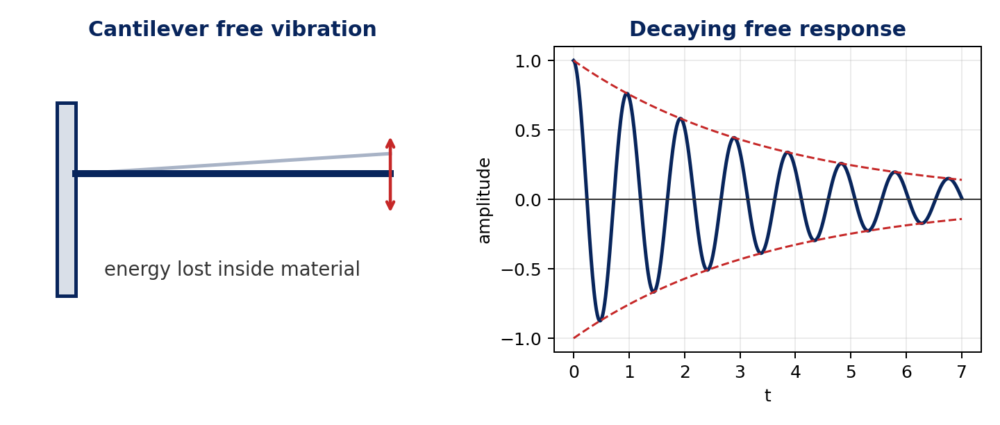
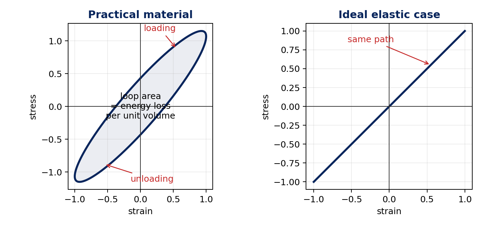
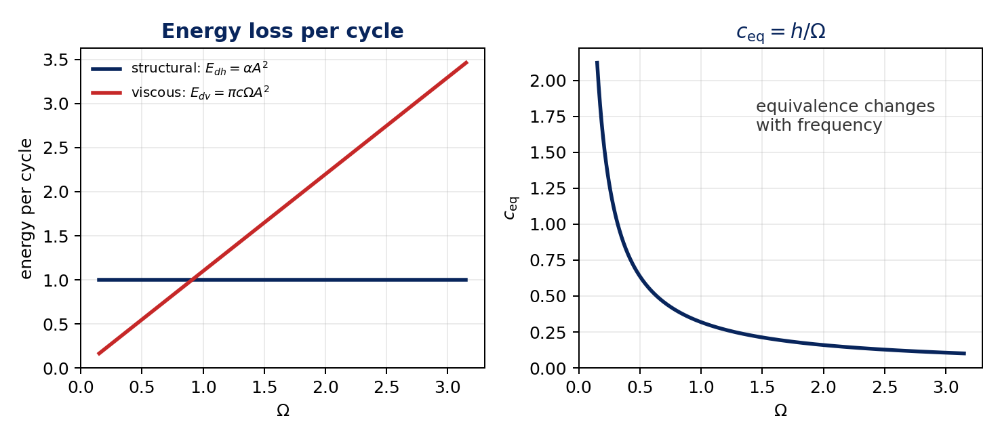
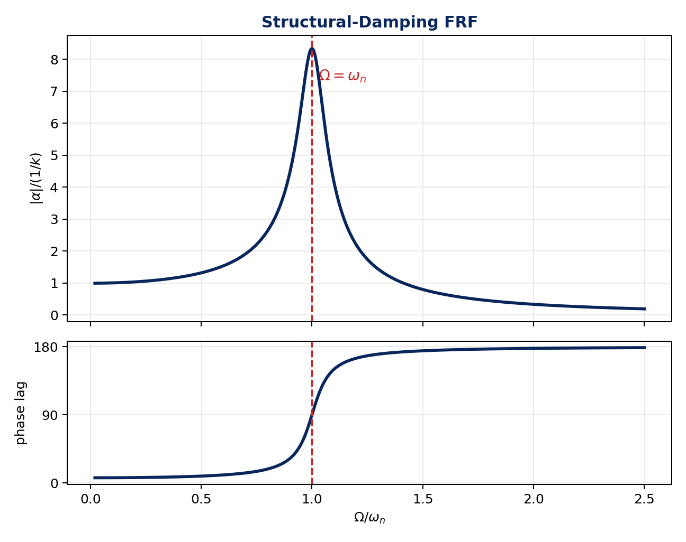
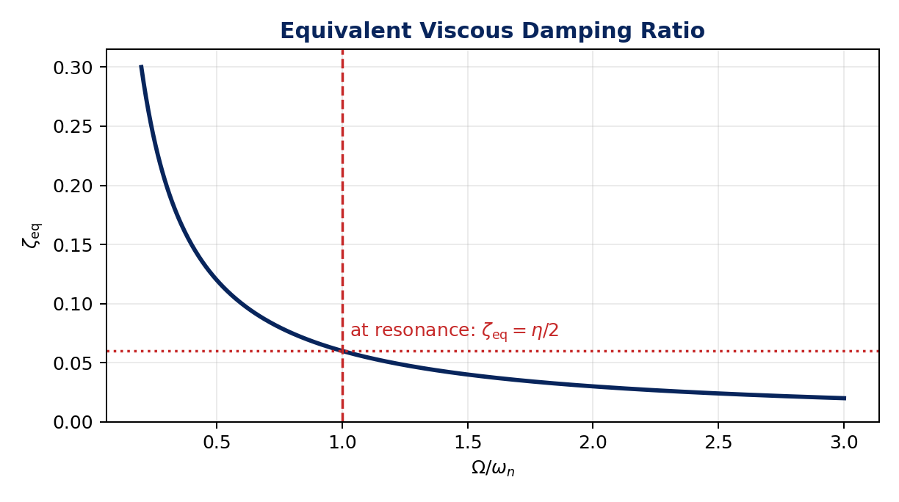

# Lecture 5 Notes: SDOF Systems With Structural Damping

**Course:** Experimental Modal Analysis, Prof. Subodh V. Modak, IIT Delhi / NPTEL  
**Prepared:** 2 May 2026

> Compact study notes, not a transcript. The supplied transcript was reorganized to preserve the lecture content while avoiding repeated spoken phrasing. Figures and longer derivations are collapsed in `
` blocks.

## Contents

- [1. Aim](#1-aim)
- [2. What Structural Damping Means](#2-what-structural-damping-means)
- [3. Hysteresis Loop and Loss Factor](#3-hysteresis-loop-and-loss-factor)
- [4. Equivalent Viscous Damping Coefficient](#4-equivalent-viscous-damping-coefficient)
- [5. Forced Vibration With Structural Damping](#5-forced-vibration-with-structural-damping)
- [6. Frequency Response Function](#6-frequency-response-function)
- [7. Free Vibration and Equivalent Viscous Approximation](#7-free-vibration-and-equivalent-viscous-approximation)
- [8. Key Takeaways](#8-key-takeaways)
- [9. Glossary](#9-glossary)

## 1. Aim

The previous lecture studied SDOF systems with **viscous damping**. This lecture studies vibration of a **single-degree-of-freedom system with structural damping**.

Structural damping is also called:

- hysteretic damping,
- internal damping.

The main idea is that energy is lost inside the material or structure while it deforms.

## 2. What Structural Damping Means

Consider a cantilever beam disturbed and then left to vibrate freely. Its vibration amplitude decays even when viscous fluid forces and dry friction are negligible. The loss is mainly due to internal material mechanisms.

Structural damping is caused by energy loss inside the material or structure due to:

- molecular friction,
- complex internal processes during deformation,
- work done against internal dissipative forces.

Figure: structural damping in a freely vibrating cantilever

## 3. Hysteresis Loop and Loss Factor

Evidence for structural damping is seen in a cyclic loading test. For a bar subjected to a harmonic force:

$$
F(t)=F_0\cos\Omega t
$$

the stress-strain curve at a material point during loading and unloading does not follow the same path. It forms a closed **hysteresis loop**.

The area enclosed by the hysteresis loop represents:

$$
\text{energy loss per unit volume per cycle}
$$

In an ideal elastic material, loading and unloading follow the same straight line, so there is no loop area and no internal energy loss.

Figure: hysteresis loop versus ideal elastic response

### Loss Factor

Structural damping is quantified by the **loss factor**:

$$
\eta=\frac{E_d}{2\pi U}
$$

where:

- $E_d$ is the energy dissipated in one cycle,
- $U$ is the energy at the beginning of the cycle.

So $\eta$ measures the fraction of stored energy lost per radian of a vibration cycle.

Typical loss-factor ranges mentioned:

| Material | Approximate loss factor $\eta$ |
| --- | --- |
| aluminum | about $0.0002$ |
| steel | about $0.002$ to $0.02$ |
| concrete | about $0.02$ to $0.06$ |
| rubber | about $0.1$ to $0.9$ |

Metals usually have small internal energy loss. Concrete, rubber, and many polymers have much larger structural damping.

## 4. Equivalent Viscous Damping Coefficient

For structural damping, a simple time-domain damping force model is not directly available. To analyze forced harmonic response, the lecture defines an **equivalent viscous damping coefficient** by matching energy dissipated per cycle.

Experimentally, for structural damping:

$$
E_{dh}\propto A^2
$$

and it is approximately independent of excitation frequency. Write:

$$
E_{dh}=\alpha A^2
$$

For viscous damping:

$$
E_{dv}=\pi c\Omega A^2
$$

Equating the two energy losses:

$$
E_{dv}=E_{dh}
$$

gives:

$$
c_{\mathrm{eq}}=\frac{\alpha}{\pi\Omega}
$$

Define the structural or hysteretic damping coefficient:

$$
h=\frac{\alpha}{\pi}
$$

Then:

$$
c_{\mathrm{eq}}=\frac{h}{\Omega}
$$

The equivalent viscous damping coefficient depends on frequency, which is a central difference from ordinary viscous damping.

Figure: energy equivalence and frequency-dependent damping

Derivation: energy loss for viscous damping

For a viscously damped harmonic response:

$$
x(t)=A\cos(\Omega t-\theta)
$$

Velocity is:

$$
\dot{x}(t)=-A\Omega\sin(\Omega t-\theta)
$$

The power dissipated by the damper is:

$$
P=f_d\dot{x}=c\dot{x}^2
$$

Energy dissipated in one cycle is:

$$
E_{dv}=\int_0^T c\dot{x}^2\,dt
$$

Using $T=2\pi/\Omega$:

$$
E_{dv}
=cA^2\Omega^2\int_0^T\sin^2(\Omega t-\theta)\,dt
$$

Since the average value of $\sin^2$ over one cycle is $1/2$:

$$
E_{dv}
=cA^2\Omega^2\frac{T}{2}
=cA^2\Omega^2\frac{\pi}{\Omega}
$$

Therefore:

$$
E_{dv}=\pi c\Omega A^2
$$

## 5. Forced Vibration With Structural Damping

For a viscously damped system:

$$
m\ddot{x}+c\dot{x}+kx=F(t)
$$

This equation is valid for general $F(t)$. For structural damping, the equivalent coefficient $c_{\mathrm{eq}}=h/\Omega$ is defined at a harmonic frequency, so the analysis is done in the **frequency domain**.

Taking the Fourier transform of the viscous equation gives:

$$
\left(-m\Omega^2+i c\Omega+k\right)X(\Omega)=F(\Omega)
$$

Replace $c$ by:

$$
c_{\mathrm{eq}}=\frac{h}{\Omega}
$$

Then:

$$
\left(-m\Omega^2+i h+k\right)X(\Omega)=F(\Omega)
$$

or:

$$
\left(k+i h-m\Omega^2\right)X(\Omega)=F(\Omega)
$$

The term:

$$
k+i h
$$

is called **complex stiffness**. It includes the elastic stiffness and the structural damping effect.

Thus:

$$
X(\Omega)=
\frac{F(\Omega)}{k+i h-m\Omega^2}
$$

### Relation Between $h$ and $\eta$

At the beginning of a cycle, if the displacement amplitude is $A$ and velocity is zero:

$$
U=\frac{1}{2}kA^2
$$

Using $E_d=\alpha A^2=\pi h A^2$:

$$
\eta=\frac{E_d}{2\pi U}
=
\frac{\pi h A^2}{2\pi\left(\frac{1}{2}kA^2\right)}
$$

Therefore:

$$
\eta=\frac{h}{k}
$$

or:

$$
h=\eta k
$$

For harmonic force:

$$
F(t)=F_0\cos\Omega t
$$

using the complex exponential method:

$$
F(t)=\Re\{F_0e^{i\Omega t}\}
$$

The steady-state response is:

$$
x(t)=
\frac{F_0/k}
{\sqrt{\left(1-r^2\right)^2+\eta^2}}
\cos(\Omega t-\beta)
$$

where:

$$
r=\frac{\Omega}{\omega_n},
\qquad
\omega_n=\sqrt{\frac{k}{m}}
$$

and:

$$
\beta=
\tan^{-1}\left(
\frac{\eta}{1-r^2}
\right)
$$

Use the quadrant-correct phase because $1-r^2$ changes sign above resonance.

Derivation: steady-state response with structural damping

Start from:

$$
X(\Omega)=
\frac{F_0}{k(1+i\eta)-m\Omega^2}
$$

Divide numerator and denominator by $k$:

$$
X(\Omega)=
\frac{F_0/k}{1-r^2+i\eta}
$$

Write the complex denominator in polar form:

$$
1-r^2+i\eta
=
\sqrt{(1-r^2)^2+\eta^2}\,e^{i\beta}
$$

where:

$$
\beta=\tan^{-1}\left(\frac{\eta}{1-r^2}\right)
$$

Therefore:

$$
X(\Omega)=
\frac{F_0/k}
{\sqrt{(1-r^2)^2+\eta^2}}e^{-i\beta}
$$

The real response is:

$$
x(t)=
\Re\{X(\Omega)e^{i\Omega t}\}
$$

so:

$$
x(t)=
\frac{F_0/k}
{\sqrt{(1-r^2)^2+\eta^2}}
\cos(\Omega t-\beta)
$$

## 6. Frequency Response Function

The receptance FRF is:

$$
\alpha(\Omega)=\frac{X(\Omega)}{F(\Omega)}
$$

For structural damping:

$$
\alpha(\Omega)=
\frac{1}{k(1+i\eta)-m\Omega^2}
$$

Equivalent form:

$$
\alpha(\Omega)=
\frac{1/k}{1-r^2+i\eta}
$$

Magnitude:

$$
|\alpha(\Omega)|=
\frac{1/k}
{\sqrt{(1-r^2)^2+\eta^2}}
$$

Phase lag:

$$
\beta=
\tan^{-1}\left(\frac{\eta}{1-r^2}\right)
$$

For structural damping:

- the FRF magnitude peak occurs exactly at $\Omega=\omega_n$,
- phase lag is $90^\circ$ at $\Omega=\omega_n$,
- below resonance, phase lag is between $0^\circ$ and $90^\circ$,
- above resonance, phase lag is between $90^\circ$ and $180^\circ$.

Figure: FRF magnitude and phase for structural damping

## 7. Free Vibration and Equivalent Viscous Approximation

Free vibration response is difficult for structural damping because the model is naturally defined in the frequency domain. There is no simple, physically realistic time-domain damping force model analogous to:

$$
f_d=c\dot{x}
$$

Taking the inverse Fourier transform of the structural-damping frequency-domain model does not give a convenient physical damping law. For this reason, the lecture focuses on steady-state harmonic response.

### Equivalent Viscous Damping Ratio

From:

$$
c_{\mathrm{eq}}=\frac{h}{\Omega}
$$

and:

$$
h=\eta k
$$

we get:

$$
c_{\mathrm{eq}}=\frac{\eta k}{\Omega}
$$

Define:

$$
\zeta_{\mathrm{eq}}=
\frac{c_{\mathrm{eq}}}{c_c}
$$

where:

$$
c_c=2\sqrt{km}
$$

Then:

$$
\zeta_{\mathrm{eq}}
=
\frac{\eta k}{2\Omega\sqrt{km}}
=
\frac{\eta\omega_n}{2\Omega}
$$

So:

$$
\zeta_{\mathrm{eq}}=
\frac{\eta}{2r}
$$

This depends on frequency. Therefore, there is no single unique viscously damped system that represents the structurally damped system over all frequencies.

Near resonance, take:

$$
\Omega=\omega_n
$$

Then:

$$
\zeta_{\mathrm{eq}}=\frac{\eta}{2}
$$

This gives a useful approximate viscous equivalent near resonance, but it is not exact over the full frequency range.

The lecture chooses this resonance-based approximation because damping has the strongest influence on the response near resonance. Away from that region, using a single constant $\zeta_{\mathrm{eq}}$ introduces error because the true equivalent value varies with $\Omega$.

Figure: equivalent viscous damping ratio

## 8. Key Takeaways

- Structural damping is energy loss internal to the material or structure.
- It is evidenced by a stress-strain hysteresis loop.
- Hysteresis-loop area equals energy loss per unit volume per cycle.
- Loss factor $\eta$ measures energy lost per radian of a cycle relative to stored energy.
- Structural damping is modeled in the frequency domain using complex stiffness $k+ih$.
- The relation between loss factor and structural damping coefficient is $\eta=h/k$.
- The structural-damping FRF is $\alpha(\Omega)=1/[k(1+i\eta)-m\Omega^2]$.
- The FRF magnitude peak occurs at $\Omega=\omega_n$.
- A unique equivalent viscous damping system does not exist for all frequencies.
- Near resonance, the useful approximation is $\zeta_{\mathrm{eq}}=\eta/2$.

## 9. Glossary

| Term | Meaning |
| --- | --- |
| structural damping | damping due to internal material/structural energy loss |
| hysteretic damping | another name for structural damping |
| internal damping | another name for structural damping |
| hysteresis loop | closed stress-strain loop during cyclic loading |
| loss factor, $\eta$ | energy loss per radian divided by stored energy |
| structural damping coefficient, $h$ | coefficient in complex stiffness, related by $h=\eta k$ |
| complex stiffness | $k+ih$ |
| equivalent viscous damping coefficient | $c_{\mathrm{eq}}=h/\Omega$ |
| equivalent damping ratio | $\zeta_{\mathrm{eq}}=\eta\omega_n/(2\Omega)$ |
| receptance FRF | displacement response per unit harmonic force |
