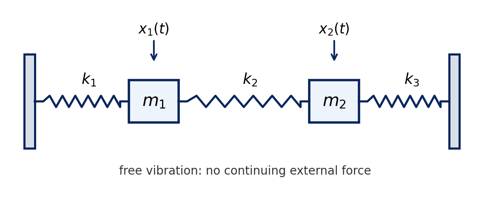
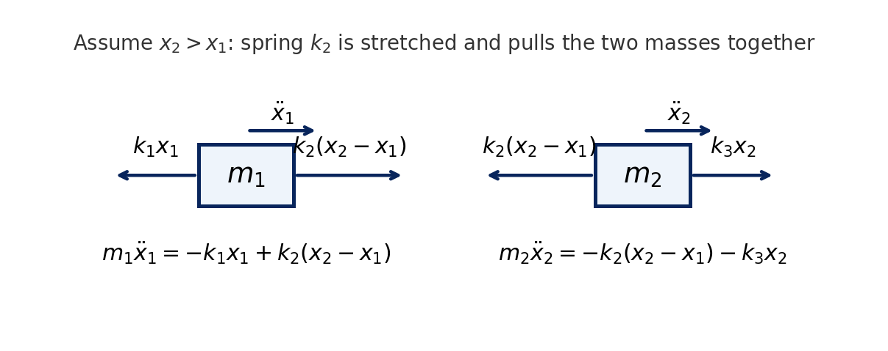
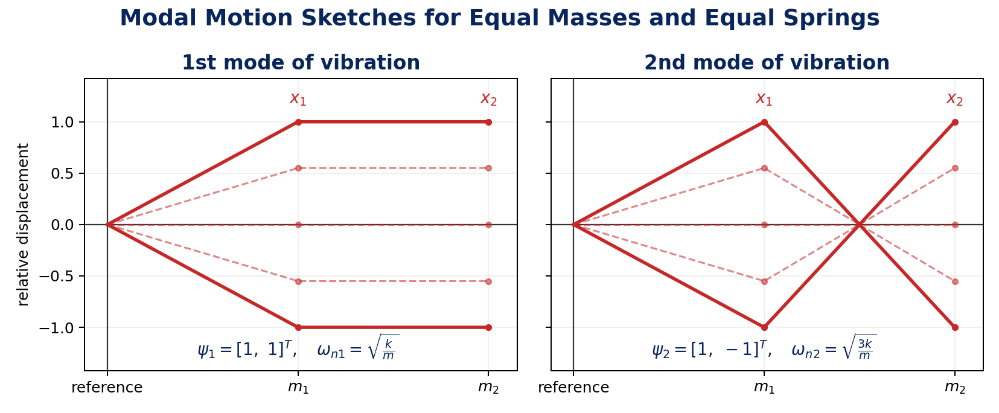

# Lecture 6 Notes: Modal Analysis of MDOF Undamped Systems

**Video:** `06.mp4`  
**Course:** Experimental Modal Analysis, Prof. Subodh V. Modak, IIT Delhi / NPTEL  
**Prepared:** 2 May 2026

> Compact study notes, not a transcript. The supplied transcript was reorganized to preserve the lecture content while avoiding repeated spoken phrasing. Figures and derivations are collapsed in `
` blocks where useful.

## Contents

- [1. Aim](#1-aim)
- [2. Two-DOF Undamped Example](#2-two-dof-undamped-example)
- [3. Free-Vibration Solution and Eigenvalue Problem](#3-free-vibration-solution-and-eigenvalue-problem)
- [4. Example With Equal Masses and Equal Springs](#4-example-with-equal-masses-and-equal-springs)
- [5. General Free-Vibration Solution](#5-general-free-vibration-solution)
- [6. Generalization to an n-DOF System](#6-generalization-to-an-n-dof-system)
- [7. Orthogonality, Modal Mass, and Modal Stiffness](#7-orthogonality-modal-mass-and-modal-stiffness)
- [8. Modal Matrix and Normalization](#8-modal-matrix-and-normalization)
- [9. Key Takeaways](#9-key-takeaways)
- [10. Glossary](#10-glossary)

## 1. Aim

This lecture begins **modal analysis of multi-degree-of-freedom undamped systems**.

Main difference from SDOF systems:

| System | Number of vibration modes |
| --- | --- |
| SDOF system | one mode |
| $n$-DOF system | $n$ modes |

Undamped systems are studied first because:

- some practical systems can be approximated reasonably well by neglecting damping,
- natural frequencies and mode shapes can be introduced clearly,
- the eigenvalue problem is easier to understand before damping is added,
- later damped-system ideas build on the undamped case.

The lecture develops the ideas using a **two-degree-of-freedom system**, then generalizes to $n$ degrees of freedom.

## 2. Two-DOF Undamped Example

The example has two masses and three springs:

- masses: $m_1,\ m_2$,
- springs: $k_1,\ k_2,\ k_3$,
- displacements: $x_1(t),\ x_2(t)$.

Figure: two-DOF undamped mass-spring system

Using Newton's law and assuming positive displacement to the right:

- If $x_2>x_1$, spring $k_2$ is stretched.
- Spring $k_2$ then pulls $m_1$ to the right and pulls $m_2$ to the left.

Figure: free-body diagrams used to write the equations

For mass $m_1$:

$$
m_1\ddot{x}_1=-k_1x_1+k_2(x_2-x_1)
$$

For mass $m_2$:

$$
m_2\ddot{x}_2=-k_2(x_2-x_1)-k_3x_2
$$

Rearranging:

$$
m_1\ddot{x}_1+(k_1+k_2)x_1-k_2x_2=0
$$

$$
m_2\ddot{x}_2-k_2x_1+(k_2+k_3)x_2=0
$$

Matrix form:

$$
\begin{bmatrix}
m_1 & 0\\
0 & m_2
\end{bmatrix}
\begin{bmatrix}
\ddot{x}_1\\
\ddot{x}_2
\end{bmatrix}
+
\begin{bmatrix}
k_1+k_2 & -k_2\\
-k_2 & k_2+k_3
\end{bmatrix}
\begin{bmatrix}
x_1\\
x_2
\end{bmatrix}
=
\begin{bmatrix}
0\\
0
\end{bmatrix}
$$

Compact form:

$$
\mathbf{M}\ddot{\mathbf{x}}+\mathbf{K}\mathbf{x}=\mathbf{0}
$$

These are the **governing equations** for the two-DOF free-vibration problem: two coupled, second-order differential equations. They are coupled because the motion of one mass appears in the equation of the other through the connecting spring $k_2$.

where:

$$
\mathbf{x}(t)=
\begin{bmatrix}
x_1(t)\\
x_2(t)
\end{bmatrix}
$$

## 3. Free-Vibration Solution and Eigenvalue Problem

Assume harmonic free vibration:

$$
\mathbf{x}(t)=\mathbf{a}\cos\omega t
$$

Then:

$$
\ddot{\mathbf{x}}(t)=-\omega^2\mathbf{a}\cos\omega t
$$

Substitution into:

$$
\mathbf{M}\ddot{\mathbf{x}}+\mathbf{K}\mathbf{x}=\mathbf{0}
$$

gives:

$$
\left(\mathbf{K}-\omega^2\mathbf{M}\right)\mathbf{a}=\mathbf{0}
$$

or:

$$
\mathbf{K}\mathbf{a}=\omega^2\mathbf{M}\mathbf{a}
$$

Let:

$$
\lambda=\omega^2
$$

Then:

$$
\mathbf{K}\mathbf{a}=\lambda\mathbf{M}\mathbf{a}
$$

This is the **generalized eigenvalue problem**.

### Standard Versus Generalized Eigenvalue Problem

Standard eigenvalue problem:

$$
\mathbf{B}\mathbf{x}=\lambda\mathbf{x}
$$

Interpretation: for a general vector $\mathbf{x}$, multiplication by $\mathbf{B}$ produces a different vector. An eigenvector is a special direction for which the result remains along the same direction and is only scaled by $\lambda$.

Generalized eigenvalue problem:

$$
\mathbf{K}\mathbf{a}=\lambda\mathbf{M}\mathbf{a}
$$

In the generalized problem, the right-hand side contains the mass matrix $\mathbf{M}$, not the identity matrix.

For non-trivial motion:

$$
\det(\mathbf{K}-\lambda\mathbf{M})=0
$$

This gives a polynomial equation in $\lambda$. For an $n$-DOF system, it is an $n$-th degree polynomial and gives $n$ eigenvalues.

In this notation:

- eigenvalues are the allowable values of $\lambda$,
- eigenvectors are the corresponding allowable values of the amplitude vector $\mathbf{a}$.

Each eigenvalue $\lambda_r$ gives a natural frequency:

$$
\omega_{nr}=\sqrt{\lambda_r}
$$

The corresponding eigenvector is the mode shape:

$$
\boldsymbol{\psi}_r
$$

Eigenvectors are not unique in magnitude. They can be multiplied by any non-zero scalar and still describe the same mode shape. What matters physically is the **relative displacement pattern**.

Each eigenvalue/eigenvector pair gives one natural way the system can vibrate. These natural ways are the **principal modes of vibration**.

## 4. Example With Equal Masses and Equal Springs

For the two-DOF example, take:

$$
m_1=m_2=m,
\qquad
k_1=k_2=k_3=k
$$

Then:

$$
\mathbf{M}=
\begin{bmatrix}
m & 0\\
0 & m
\end{bmatrix},
\qquad
\mathbf{K}=
\begin{bmatrix}
2k & -k\\
-k & 2k
\end{bmatrix}
$$

The characteristic equation is:

$$
\det
\left(
\begin{bmatrix}
2k & -k\\
-k & 2k
\end{bmatrix}
-
\lambda
\begin{bmatrix}
m & 0\\
0 & m
\end{bmatrix}
\right)=0
$$

Thus:

$$
(2k-\lambda m)^2-k^2=0
$$

so:

$$
2k-\lambda m=\pm k
$$

The eigenvalues are:

$$
\lambda_1=\frac{k}{m},
\qquad
\lambda_2=\frac{3k}{m}
$$

Natural frequencies:

$$
\omega_{n1}=\sqrt{\frac{k}{m}},
\qquad
\omega_{n2}=\sqrt{\frac{3k}{m}}
$$

Mode shapes can be chosen as:

$$
\boldsymbol{\psi}_1=
\begin{bmatrix}
1\\
1
\end{bmatrix},
\qquad
\boldsymbol{\psi}_2=
\begin{bmatrix}
1\\
-1
\end{bmatrix}
$$

Interpretation:

- Mode 1: both masses move in phase.
- Mode 2: the masses move out of phase.
- These are the two principal modes of the two-DOF system.

Figure: mode shapes for equal masses and equal springs

Derivation: eigenvectors for the equal system

For $\lambda_1=k/m$:

$$
\left(
\begin{bmatrix}
2k & -k\\
-k & 2k
\end{bmatrix}
-
\frac{k}{m}
\begin{bmatrix}
m & 0\\
0 & m
\end{bmatrix}
\right)
\begin{bmatrix}
a_1\\
a_2
\end{bmatrix}
=
\begin{bmatrix}
0\\
0
\end{bmatrix}
$$

so:

$$
\begin{bmatrix}
k & -k\\
-k & k
\end{bmatrix}
\begin{bmatrix}
a_1\\
a_2
\end{bmatrix}
=
\begin{bmatrix}
0\\
0
\end{bmatrix}
$$

Both equations give:

$$
a_1=a_2
$$

Choose $a_2=1$, giving:

$$
\boldsymbol{\psi}_1=
\begin{bmatrix}
1\\
1
\end{bmatrix}
$$

If $a_2=\alpha$, then:

$$
\boldsymbol{\psi}_1=
\alpha
\begin{bmatrix}
1\\
1
\end{bmatrix}
$$

This shows that eigenvectors are scaled vectors.

For $\lambda_2=3k/m$, the equations give:

$$
a_1=-a_2
$$

Choose $a_2=-1$, giving:

$$
\boldsymbol{\psi}_2=
\begin{bmatrix}
1\\
-1
\end{bmatrix}
$$

## 5. General Free-Vibration Solution

For the first mode:

$$
\mathbf{x}_1(t)=
A_1\boldsymbol{\psi}_1\cos\omega_{n1}t
+
B_1\boldsymbol{\psi}_1\sin\omega_{n1}t
$$

For the second mode:

$$
\mathbf{x}_2(t)=
A_2\boldsymbol{\psi}_2\cos\omega_{n2}t
+
B_2\boldsymbol{\psi}_2\sin\omega_{n2}t
$$

The total free response of the two-DOF system is the linear combination:

$$
\mathbf{x}(t)=
\sum_{i=1}^{2}
\left[
A_i\boldsymbol{\psi}_i\cos\omega_{ni}t
+
B_i\boldsymbol{\psi}_i\sin\omega_{ni}t
\right]
$$

The constants $A_1,A_2,B_1,B_2$ depend on the initial conditions:

$$
\mathbf{x}(0),
\qquad
\dot{\mathbf{x}}(0)
$$

For a second-order system, each DOF needs initial displacement and initial velocity to define the state.

## 6. Generalization to an n-DOF System

For an $n$-DOF undamped system:

$$
\mathbf{M}\ddot{\mathbf{x}}+\mathbf{K}\mathbf{x}=\mathbf{0}
$$

where:

- $\mathbf{M}$ and $\mathbf{K}$ are $n\times n$ matrices,
- $\mathbf{M}$ is symmetric and positive definite,
- $\mathbf{K}$ is symmetric and positive definite or positive semi-definite,
- the system has $n$ eigenvalues,
- the system has $n$ eigenvectors,
- therefore it has $n$ natural frequencies and $n$ mode shapes.

### Matrix Properties

Mass matrix:

$$
T=\frac{1}{2}\dot{\mathbf{x}}^T\mathbf{M}\dot{\mathbf{x}}
$$

For any non-zero velocity vector, kinetic energy is positive. Therefore $\mathbf{M}$ is positive definite.

Stiffness matrix:

$$
U=\frac{1}{2}\mathbf{x}^T\mathbf{K}\mathbf{x}
$$

If the system has no rigid-body mode, $\mathbf{K}$ is positive definite. If a rigid-body motion is possible, $\mathbf{K}$ is positive semi-definite because non-zero displacement can occur with zero strain energy.

Example of a rigid-body mode: if two free masses connected by one spring move together by the same displacement, the spring does not stretch and strain energy is zero.

## 7. Orthogonality, Modal Mass, and Modal Stiffness

For the $r$-th mode:

$$
\mathbf{K}\boldsymbol{\psi}_r
=
\lambda_r\mathbf{M}\boldsymbol{\psi}_r
$$

For the $s$-th mode:

$$
\mathbf{K}\boldsymbol{\psi}_s
=
\lambda_s\mathbf{M}\boldsymbol{\psi}_s
$$

For distinct eigenvalues and $r\ne s$, the eigenvectors are orthogonal with respect to the mass and stiffness matrices:

$$
\boldsymbol{\psi}_r^T\mathbf{M}\boldsymbol{\psi}_s=0
$$

$$
\boldsymbol{\psi}_r^T\mathbf{K}\boldsymbol{\psi}_s=0
$$

For $r=s$, these products are not zero. Define:

$$
m_r=
\boldsymbol{\psi}_r^T\mathbf{M}\boldsymbol{\psi}_r
$$

as the **modal mass**, and:

$$
k_r=
\boldsymbol{\psi}_r^T\mathbf{K}\boldsymbol{\psi}_r
$$

as the **modal stiffness**.

Using the eigenvalue equation:

$$
\lambda_r=\frac{k_r}{m_r}
$$

and:

$$
\omega_{nr}=\sqrt{\lambda_r}
=
\sqrt{\frac{k_r}{m_r}}
$$

Derivation: orthogonality relation

Start with:

$$
\mathbf{K}\boldsymbol{\psi}_r
=
\lambda_r\mathbf{M}\boldsymbol{\psi}_r
$$

and:

$$
\mathbf{K}\boldsymbol{\psi}_s
=
\lambda_s\mathbf{M}\boldsymbol{\psi}_s
$$

Premultiply the first equation by $\boldsymbol{\psi}_s^T$:

$$
\boldsymbol{\psi}_s^T\mathbf{K}\boldsymbol{\psi}_r
=
\lambda_r
\boldsymbol{\psi}_s^T\mathbf{M}\boldsymbol{\psi}_r
$$

Premultiply the second equation by $\boldsymbol{\psi}_r^T$:

$$
\boldsymbol{\psi}_r^T\mathbf{K}\boldsymbol{\psi}_s
=
\lambda_s
\boldsymbol{\psi}_r^T\mathbf{M}\boldsymbol{\psi}_s
$$

Because $\mathbf{M}$ and $\mathbf{K}$ are symmetric:

$$
\boldsymbol{\psi}_s^T\mathbf{K}\boldsymbol{\psi}_r
=
\boldsymbol{\psi}_r^T\mathbf{K}\boldsymbol{\psi}_s
$$

and:

$$
\boldsymbol{\psi}_s^T\mathbf{M}\boldsymbol{\psi}_r
=
\boldsymbol{\psi}_r^T\mathbf{M}\boldsymbol{\psi}_s
$$

Subtracting gives:

$$
(\lambda_r-\lambda_s)
\boldsymbol{\psi}_r^T\mathbf{M}\boldsymbol{\psi}_s=0
$$

If $\lambda_r\ne\lambda_s$, then:

$$
\boldsymbol{\psi}_r^T\mathbf{M}\boldsymbol{\psi}_s=0
$$

Substitute this result back into either eigenvalue equation to get:

$$
\boldsymbol{\psi}_r^T\mathbf{K}\boldsymbol{\psi}_s=0
$$

## 8. Modal Matrix and Normalization

The **modal matrix** or **eigenvector matrix** is formed by placing all mode shapes as columns:

$$
\boldsymbol{\Psi}
=
\begin{bmatrix}
\boldsymbol{\psi}_1&
\boldsymbol{\psi}_2&
\cdots&
\boldsymbol{\psi}_n
\end{bmatrix}
$$

Orthogonality can be written compactly as:

$$
\boldsymbol{\Psi}^T\mathbf{M}\boldsymbol{\Psi}
=
\operatorname{diag}(m_{r1},m_{r2},\ldots,m_{rn})
$$

$$
\boldsymbol{\Psi}^T\mathbf{K}\boldsymbol{\Psi}
=
\operatorname{diag}(k_{r1},k_{r2},\ldots,k_{rn})
$$

These diagonal forms are important because they later allow the coupled physical-coordinate equations to be decoupled into modal equations.

### Normalization of Eigenvectors

Because eigenvectors can be scaled arbitrarily, a normalization convention is needed.

Common choices mentioned:

| Normalization method | Meaning |
| --- | --- |
| maximum-element normalization | divide by the largest element so the maximum element is unity |
| unit-length normalization | divide by the Euclidean norm so vector length is one |
| mass normalization | divide by the square root of modal mass |

For mass normalization:

$$
\boldsymbol{\phi}_r=
\frac{\boldsymbol{\psi}_r}{\sqrt{m_r}}
$$

Then:

$$
\boldsymbol{\phi}_r^T\mathbf{M}\boldsymbol{\phi}_r=1
$$

Let:

$$
\boldsymbol{\Phi}
=
\begin{bmatrix}
\boldsymbol{\phi}_1&
\boldsymbol{\phi}_2&
\cdots&
\boldsymbol{\phi}_n
\end{bmatrix}
$$

Then the mass-normalized orthogonality relations are:

$$
\boldsymbol{\Phi}^T\mathbf{M}\boldsymbol{\Phi}
=
\mathbf{I}
$$

and:

$$
\boldsymbol{\Phi}^T\mathbf{K}\boldsymbol{\Phi}
=
\operatorname{diag}(\lambda_1,\lambda_2,\ldots,\lambda_n)
$$

## 9. Key Takeaways

- An $n$-DOF undamped system has $n$ natural frequencies and $n$ mode shapes.
- Free vibration leads to the generalized eigenvalue problem $\mathbf{K}\mathbf{a}=\lambda\mathbf{M}\mathbf{a}$.
- Eigenvalues give $\omega_{nr}=\sqrt{\lambda_r}$.
- Eigenvectors give mode shapes and are arbitrarily scalable.
- In the two-DOF equal system, the two modes are in-phase and out-of-phase motion.
- $\mathbf{M}$ is symmetric positive definite.
- $\mathbf{K}$ is symmetric positive definite or positive semi-definite, depending on rigid-body modes.
- Distinct mode shapes are orthogonal with respect to both $\mathbf{M}$ and $\mathbf{K}$.
- Modal mass and modal stiffness satisfy $\lambda_r=k_r/m_r$.
- Mass normalization gives $\boldsymbol{\Phi}^T\mathbf{M}\boldsymbol{\Phi}=\mathbf{I}$.

## 10. Glossary

| Term | Meaning |
| --- | --- |
| MDOF system | multi-degree-of-freedom system |
| mode of vibration | one natural pattern of free vibration |
| eigenvalue | $\lambda_r=\omega_{nr}^2$ |
| eigenvector | vector giving the relative displacement pattern of a mode |
| mode shape | physical interpretation of an eigenvector |
| generalized eigenvalue problem | $\mathbf{K}\mathbf{a}=\lambda\mathbf{M}\mathbf{a}$ |
| modal mass | $m_r=\boldsymbol{\psi}_r^T\mathbf{M}\boldsymbol{\psi}_r$ |
| modal stiffness | $k_r=\boldsymbol{\psi}_r^T\mathbf{K}\boldsymbol{\psi}_r$ |
| modal matrix | matrix whose columns are mode shapes |
| orthogonality | property that different modes are uncoupled under $\mathbf{M}$ and $\mathbf{K}$ products |
| mass normalization | scaling modes so each modal mass is unity |
