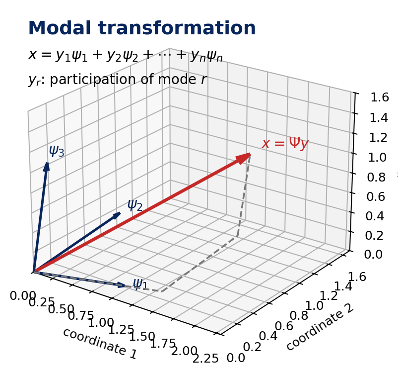
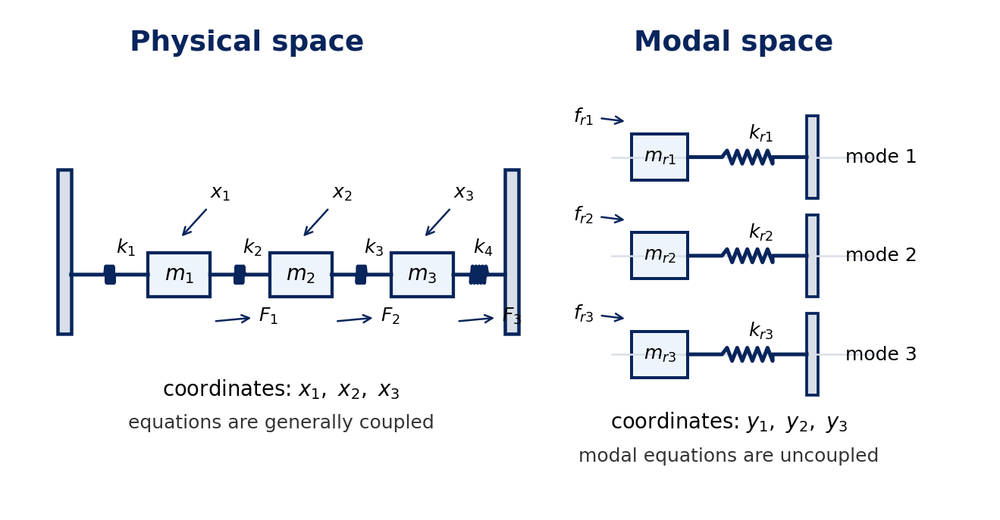
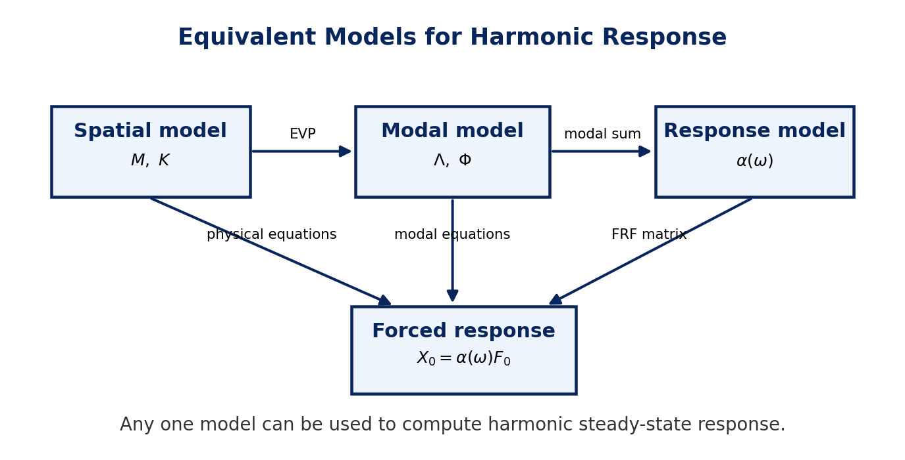

# Lecture 7 Notes: Forced Vibration of Undamped MDOF Systems

**Course:** Experimental Modal Analysis, Prof. Subodh V. Modak, IIT Delhi / NPTEL  
**Prepared:** 2 May 2026

> Compact study notes, not a transcript. The lecture content is reorganized to avoid repeated spoken phrasing while preserving the definitions, equations, and interpretation.

## Contents

- [1. Aim](#1-aim)
- [2. Direct Harmonic Response](#2-direct-harmonic-response)
- [3. Modal Transformation](#3-modal-transformation)
- [4. Decoupled Modal Equations](#4-decoupled-modal-equations)
- [5. Physical Space and Modal Space](#5-physical-space-and-modal-space)
- [6. Modal Superposition Response](#6-modal-superposition-response)
- [7. Spatial, Modal, and Response Models](#7-spatial-modal-and-response-models)
- [8. FRF Matrix](#8-frf-matrix)
- [9. Key Takeaways](#9-key-takeaways)
- [10. Glossary](#10-glossary)

## 1. Aim

This lecture continues modal analysis of **undamped multi-degree-of-freedom systems**, now for **forced vibration**.

Main goal:

- find the response of an undamped MDOF system to harmonic forces,
- first by a direct method,
- then by modal analysis, which introduces modal coordinates, modal space, modal force, and the FRF matrix.

Assumption carried forward: the system is linear. Under this assumption, reciprocity holds and the mass and stiffness matrices are symmetric.

### Reciprocity

If a force is applied at coordinate 1 and the static displacement is measured at coordinate 2, the result equals the displacement at coordinate 1 when the same force is applied at coordinate 2:

$$
\delta_{21}\ \text{due to}\ F_1
=
\delta_{12}\ \text{due to}\ F_2
$$

This reciprocity is one reason the system matrices are symmetric for linear systems:

$$
\mathbf{M}^T=\mathbf{M},
\qquad
\mathbf{K}^T=\mathbf{K}
$$

## 2. Direct Harmonic Response

The undamped MDOF equation of motion is:

$$
\mathbf{M}\ddot{\mathbf{x}}(t)+\mathbf{K}\mathbf{x}(t)=\mathbf{f}(t)
$$

For harmonic force:

$$
\mathbf{f}(t)=\mathbf{F}_0\cos\omega t
$$

The total response is written as:

$$
\mathbf{x}(t)=\mathbf{x}_c(t)+\mathbf{x}_p(t)
$$

where $\mathbf{x}_c(t)$ is the complementary/free-vibration part and $\mathbf{x}_p(t)$ is the steady-state particular part. The direct method below first finds $\mathbf{x}_p(t)$.

Use the complex exponential method:

$$
\bar{\mathbf{f}}(t)=\mathbf{F}_0 e^{i\omega t},
\qquad
\mathbf{f}(t)=\operatorname{Re}\{\bar{\mathbf{f}}(t)\}
$$

Assume the steady-state complex response:

$$
\bar{\mathbf{x}}_p(t)=\mathbf{X}_0e^{i\omega t}
$$

Substitute into the equation of motion:

$$
\left(\mathbf{K}-\omega^2\mathbf{M}\right)\mathbf{X}_0
=
\mathbf{F}_0
$$

Therefore:

$$
\mathbf{X}_0
=
\left(\mathbf{K}-\omega^2\mathbf{M}\right)^{-1}\mathbf{F}_0
$$

The matrix:

$$
\mathbf{K}-\omega^2\mathbf{M}
$$

is the **dynamic stiffness matrix**. It includes stiffness and inertia effects and changes with excitation frequency.

Define the FRF matrix:

$$
\boldsymbol{\alpha}(\omega)
=
\left(\mathbf{K}-\omega^2\mathbf{M}\right)^{-1}
$$

Then:

$$
\mathbf{X}_0=\boldsymbol{\alpha}(\omega)\mathbf{F}_0
$$

This is the **direct method**: solve the coupled physical-coordinate equations directly.

## 3. Modal Transformation

The modal-analysis method transforms physical coordinates into modal coordinates.

In an ordinary 3D basis:

$$
\mathbf{x}
=x_1\mathbf{i}+x_2\mathbf{j}+x_3\mathbf{k}
$$

with basis vectors:

$$
\mathbf{i}=
\begin{bmatrix}
1\\0\\0
\end{bmatrix},
\qquad
\mathbf{j}=
\begin{bmatrix}
0\\1\\0
\end{bmatrix},
\qquad
\mathbf{k}=
\begin{bmatrix}
0\\0\\1
\end{bmatrix}
$$

In modal transformation, the basis vectors are the system's eigenvectors:

$$
\mathbf{x}
=
y_1\boldsymbol{\psi}_1
+y_2\boldsymbol{\psi}_2
+\cdots
+y_n\boldsymbol{\psi}_n
$$

Compactly:

$$
\mathbf{x}=\boldsymbol{\Psi}\mathbf{y}
$$

The eigenvectors are linearly independent, so they can span the $n$-dimensional displacement space and serve as basis vectors. This is the modal expansion theorem used in modal analysis.

where:

$$
\boldsymbol{\Psi}
=
\begin{bmatrix}
\boldsymbol{\psi}_1&
\boldsymbol{\psi}_2&
\cdots&
\boldsymbol{\psi}_n
\end{bmatrix}
$$

and:

$$
\mathbf{y}
=
\begin{bmatrix}
y_1\\
y_2\\
\vdots\\
y_n
\end{bmatrix}
$$

The modal coordinates $y_1,y_2,\ldots,y_n$ are **participation factors**. The coordinate $y_r$ measures how much the $r$-th mode contributes to the physical response.

Figure: modal transformation as a mode-shape expansion

## 4. Decoupled Modal Equations

Start with:

$$
\mathbf{M}\ddot{\mathbf{x}}+\mathbf{K}\mathbf{x}=\mathbf{f}
$$

Use:

$$
\mathbf{x}=\boldsymbol{\Psi}\mathbf{y},
\qquad
\ddot{\mathbf{x}}=\boldsymbol{\Psi}\ddot{\mathbf{y}}
$$

Then:

$$
\mathbf{M}\boldsymbol{\Psi}\ddot{\mathbf{y}}
+
\mathbf{K}\boldsymbol{\Psi}\mathbf{y}
=
\mathbf{f}
$$

Premultiply by $\boldsymbol{\Psi}^T$:

$$
\boldsymbol{\Psi}^T\mathbf{M}\boldsymbol{\Psi}\ddot{\mathbf{y}}
+
\boldsymbol{\Psi}^T\mathbf{K}\boldsymbol{\Psi}\mathbf{y}
=
\boldsymbol{\Psi}^T\mathbf{f}
$$

Using orthogonality:

$$
\boldsymbol{\Psi}^T\mathbf{M}\boldsymbol{\Psi}
=
\mathbf{M}_r
=
\operatorname{diag}(m_{r1},m_{r2},\ldots,m_{rn})
$$

$$
\boldsymbol{\Psi}^T\mathbf{K}\boldsymbol{\Psi}
=
\mathbf{K}_r
=
\operatorname{diag}(k_{r1},k_{r2},\ldots,k_{rn})
$$

and:

$$
\mathbf{f}_r=\boldsymbol{\Psi}^T\mathbf{f}
$$

Therefore:

$$
\mathbf{M}_r\ddot{\mathbf{y}}+\mathbf{K}_r\mathbf{y}=\mathbf{f}_r
$$

The original equations are generally coupled. The modal equations are uncoupled because $\mathbf{M}_r$ and $\mathbf{K}_r$ are diagonal.

For the $r$-th mode:

$$
m_r\ddot{y}_r+k_r y_r=f_r
$$

This has the same form as an SDOF equation:

$$
m\ddot{q}+kq=f
$$

So each modal equation can be interpreted as the equation of motion of a **hypothetical SDOF system** corresponding to one mode of the MDOF system.

Names:

| Quantity | Meaning |
| --- | --- |
| $m_r$ | modal mass of the $r$-th mode |
| $k_r$ | modal stiffness of the $r$-th mode |
| $f_r$ | modal force in the $r$-th mode |
| $y_r$ | modal response or response in the $r$-th mode |

Thus:

| Mode index | Modal response |
| --- | --- |
| $r=1$ | $y_1$, first modal response |
| $r=2$ | $y_2$, second modal response |
| $r=n$ | $y_n$, $n$-th modal response |

## 5. Physical Space and Modal Space

Physical space is described by physical coordinates such as:

$$
\mathbf{x}^T=
\begin{bmatrix}
x_1 & x_2 & x_3
\end{bmatrix}
$$

Modal space is described by modal coordinates:

$$
\mathbf{y}^T=
\begin{bmatrix}
y_1 & y_2 & y_3
\end{bmatrix}
$$

Modal space is the space spanned by the eigenvectors of the system. Each eigenvector is associated with one modal response.

For a 3-DOF system, the physical system can be represented in modal space by three uncoupled hypothetical SDOF systems, one for each mode.

Figure: physical space versus modal space

Important comparison:

| Physical space | Modal space |
| --- | --- |
| coordinates are physical DOFs $x_i$ | coordinates are modal responses $y_r$ |
| equations are generally coupled | equations are uncoupled |
| $x_i$ gives response at the $i$-th DOF | $y_r$ gives response in the $r$-th mode |
| $x_i$ contains contributions from all modes | $y_r\boldsymbol{\psi}_r$ gives the physical response contribution of one mode at all DOFs |

Thus, the physical response is assembled from modal contributions:

$$
\mathbf{x}
=
\sum_{r=1}^{n}
\boldsymbol{\psi}_r y_r
$$

## 6. Modal Superposition Response

For harmonic force, use:

$$
\bar{\mathbf{f}}(t)=\mathbf{F}_0e^{i\omega t}
$$

The $r$-th modal force is:

$$
\bar{f}_r(t)
=
\boldsymbol{\psi}_r^T\mathbf{F}_0e^{i\omega t}
$$

Its amplitude is:

$$
f_{r0}=\boldsymbol{\psi}_r^T\mathbf{F}_0
$$

Assume:

$$
\bar{y}_r(t)=Y_{r0}e^{i\omega t}
$$

Substitute into:

$$
m_r\ddot{y}_r+k_r y_r=f_r
$$

to get:

$$
\left(k_r-\omega^2m_r\right)Y_{r0}=f_{r0}
$$

Therefore:

$$
Y_{r0}
=
\frac{\boldsymbol{\psi}_r^T\mathbf{F}_0}
{k_r-\omega^2m_r}
$$

and:

$$
\bar{y}_r(t)
=
\frac{\boldsymbol{\psi}_r^T\mathbf{F}_0}
{k_r-\omega^2m_r}
e^{i\omega t}
$$

Physical steady-state response amplitude:

$$
\mathbf{X}_0
=
\sum_{r=1}^{n}
\boldsymbol{\psi}_r
\frac{\boldsymbol{\psi}_r^T\mathbf{F}_0}
{k_r-\omega^2m_r}
$$

If mass-normalized modes are used:

$$
\boldsymbol{\phi}_r=\frac{\boldsymbol{\psi}_r}{\sqrt{m_r}},
\qquad
\omega_r^2=\frac{k_r}{m_r}
$$

then:

$$
\mathbf{X}_0
=
\left[
\sum_{r=1}^{n}
\frac{\boldsymbol{\phi}_r\boldsymbol{\phi}_r^T}
{\omega_r^2-\omega^2}
\right]\mathbf{F}_0
$$

### Complete Response

The complete response is:

$$
\mathbf{x}(t)=\mathbf{x}_c(t)+\mathbf{x}_p(t)
$$

The complementary part is the free-vibration solution:

$$
\mathbf{x}_c(t)=
\sum_{i=1}^{n}
\left[
A_i\boldsymbol{\phi}_i\cos\omega_i t
+
B_i\boldsymbol{\phi}_i\sin\omega_i t
\right]
$$

The steady-state particular part for $\mathbf{f}(t)=\mathbf{F}_0\cos\omega t$ is:

$$
\mathbf{x}_p(t)=
\left[
\sum_{r=1}^{n}
\frac{\boldsymbol{\phi}_r\boldsymbol{\phi}_r^T}
{\omega_r^2-\omega^2}
\right]\mathbf{F}_0\cos\omega t
$$

Equivalently, the complete response can be written in one line as:

$$
\mathbf{x}(t)=
\sum_{i=1}^{n}
\left[
A_i\boldsymbol{\phi}_i\cos\omega_i t
+
B_i\boldsymbol{\phi}_i\sin\omega_i t
\right]
+
\left[
\sum_{r=1}^{n}
\frac{\boldsymbol{\phi}_r\boldsymbol{\phi}_r^T}
{\omega_r^2-\omega^2}
\right]\mathbf{F}_0\cos\omega t
$$

The constants $A_i$ and $B_i$ are found from initial displacement and velocity:

$$
\mathbf{x}(0),
\qquad
\dot{\mathbf{x}}(0)
$$

## 7. Spatial, Modal, and Response Models

Three equivalent descriptions of the same undamped linear system are used.

| Model | Contents | How it predicts response |
| --- | --- | --- |
| spatial model | $\mathbf{M},\mathbf{K}$ | solve physical-coordinate equations |
| modal model | eigenvalue matrix and mass-normalized eigenvector matrix | use modal superposition |
| response model | FRF matrix $\boldsymbol{\alpha}(\omega)$ | multiply by force amplitude |

For an undamped system, the **spatial model** is:

$$
\{\mathbf{M},\mathbf{K}\}
$$

With the excitation force vector as input, the spatial model predicts the response vector:

$$
\{\mathbf{f}\}
\longrightarrow
\{\mathbf{M},\mathbf{K}\}
\longrightarrow
\{\mathbf{x}\}
$$

The **modal model** is:

$$
\boldsymbol{\Lambda}
=
\operatorname{diag}
(\omega_1^2,\omega_2^2,\ldots,\omega_n^2)
$$

and:

$$
\boldsymbol{\Phi}
=
\begin{bmatrix}
\boldsymbol{\phi}_1&
\boldsymbol{\phi}_2&
\cdots&
\boldsymbol{\phi}_n
\end{bmatrix}
$$

With the excitation force vector as input, the modal model can also predict the response vector:

$$
\{\mathbf{f}\}
\longrightarrow
\{\boldsymbol{\Lambda},\boldsymbol{\Phi}\}
\longrightarrow
\{\mathbf{x}\}
$$

The **response model** in the frequency domain is:

$$
\boldsymbol{\alpha}(\omega)
$$

Figure: equivalent model descriptions

## 8. FRF Matrix

For an $n$-DOF system, there are:

- $n$ possible response coordinates,
- $n$ possible force coordinates,
- therefore $n^2$ FRFs.

The FRF matrix is:

$$
\boldsymbol{\alpha}(\omega)
=
\begin{bmatrix}
\alpha_{11} & \alpha_{12} & \cdots & \alpha_{1n}\\
\alpha_{21} & \alpha_{22} & \cdots & \alpha_{2n}\\
\vdots & \vdots & \ddots & \vdots\\
\alpha_{n1} & \alpha_{n2} & \cdots & \alpha_{nn}
\end{bmatrix}
$$

The element $\alpha_{jk}(\omega)$ is:

> steady-state response amplitude at DOF $j$ due to a unit-amplitude harmonic force at DOF $k$, with all other force components zero.

Equivalently:

$$
\alpha_{jk}(\omega)
=
\frac{X_j(\omega)}{F_k(\omega)}
\quad
\text{when }F_q=0\text{ for all }q\ne k
$$

For a linear system, the FRF matrix is symmetric:

$$
\alpha_{jk}(\omega)=\alpha_{kj}(\omega)
$$

### FRF From Spatial Model

From the direct method:

$$
\boldsymbol{\alpha}(\omega)
=
\left(\mathbf{K}-\omega^2\mathbf{M}\right)^{-1}
$$

### FRF From Modal Model

From modal superposition:

$$
\boldsymbol{\alpha}(\omega)
=
\sum_{r=1}^{n}
\frac{\boldsymbol{\phi}_r\boldsymbol{\phi}_r^T}
{\omega_r^2-\omega^2}
$$

The individual FRF element is:

$$
\alpha_{jk}(\omega)
=
\sum_{r=1}^{n}
\frac{\phi_{jr}\phi_{kr}}
{\omega_r^2-\omega^2}
$$

where $\phi_{jr}$ is the $j$-th component of the $r$-th mass-normalized mode shape.

### Response From the FRF Matrix

If many harmonic forces act at the same frequency:

$$
\mathbf{F}_0=
\begin{bmatrix}
F_{01}\\
F_{02}\\
\vdots\\
F_{0n}
\end{bmatrix}
$$

then:

$$
\mathbf{X}_0(\omega)=\boldsymbol{\alpha}(\omega)\mathbf{F}_0
$$

For the $j$-th response:

$$
x_{0j}(\omega)=
\alpha_{j1}(\omega)F_{01}(\omega)
+
\alpha_{j2}(\omega)F_{02}(\omega)
+
\cdots
+
\alpha_{jn}(\omega)F_{0n}(\omega)
$$

So the response model is a valid model because FRFs alone can predict harmonic steady-state response.

## 9. Key Takeaways

- Direct forced response uses $\mathbf{X}_0=(\mathbf{K}-\omega^2\mathbf{M})^{-1}\mathbf{F}_0$.
- $\mathbf{K}-\omega^2\mathbf{M}$ is the dynamic stiffness matrix.
- Modal transformation expresses physical displacement as $\mathbf{x}=\boldsymbol{\Psi}\mathbf{y}$.
- The modal coordinates $y_r$ are participation factors or modal responses.
- Orthogonality converts coupled physical equations into uncoupled modal equations.
- Each modal equation behaves like a hypothetical SDOF system.
- Spatial, modal, and response models are equivalent ways to predict system response.
- For an $n$-DOF system, the FRF matrix contains $n^2$ FRFs.
- The modal form of the FRF matrix is $\boldsymbol{\alpha}(\omega)=\sum_r\boldsymbol{\phi}_r\boldsymbol{\phi}_r^T/(\omega_r^2-\omega^2)$.

## 10. Glossary

| Term | Meaning |
| --- | --- |
| dynamic stiffness matrix | $\mathbf{K}-\omega^2\mathbf{M}$ |
| direct method | solving the physical-coordinate equations directly |
| modal transformation | coordinate change $\mathbf{x}=\boldsymbol{\Psi}\mathbf{y}$ |
| modal coordinate | participation factor $y_r$ for the $r$-th mode |
| modal force | $f_r=\boldsymbol{\psi}_r^T\mathbf{f}$ |
| modal space | space spanned by the eigenvectors of the system |
| physical space | space described by physical DOFs such as $x_1,x_2,\ldots,x_n$ |
| spatial model | model described by $\mathbf{M}$ and $\mathbf{K}$ |
| modal model | model described by eigenvalues and mode shapes |
| response model | model described by FRFs |
| FRF matrix | matrix relating harmonic response amplitudes to harmonic force amplitudes |
