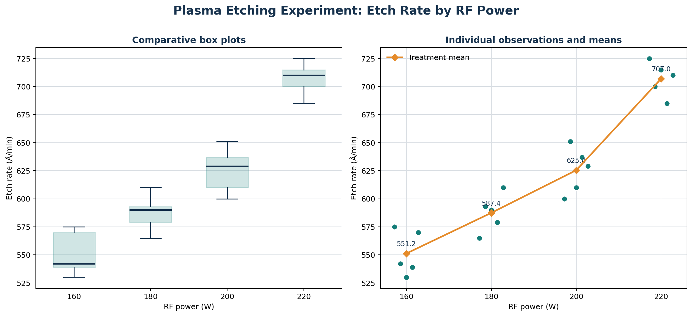

# Single-Factor Experiments and One-Way ANOVA

This chapter explains how a completely randomized experiment with one factor and several levels is modeled and analyzed using **one-way analysis of variance (ANOVA)**.

Why use ANOVA instead of multiple t-tests?

A two-sample t-test compares two population means. When a factor has more than two levels, performing a separate t-test for every pair is not a satisfactory general strategy: the number of comparisons grows quickly.

One-way ANOVA instead asks one global question at a controlled significance level:

> Do all factor levels have the same population mean, or does at least one level differ?

The name **analysis of variance** may sound surprising because the scientific question concerns means. The method works by partitioning response variability into a component associated with differences among treatment means and a component associated with random error within treatments.

## Single-Factor Experimental Design

Consider one factor with $a$ levels, also called **treatments**. Suppose each treatment is observed $n$ times, giving a balanced experiment with:

$$
N=an
$$

total runs.

In a **completely randomized design (CRD)**, the $N$ experimental runs are performed in random order. Randomization helps protect the treatment comparison from time trends and other uncontrolled variables.

The basic notation is:

| Symbol | Meaning |
| --- | --- |
| $i=1,2,\ldots,a$ | Treatment or factor-level index |
| $j=1,2,\ldots,n$ | Replicate index within a treatment |
| $y_{ij}$ | Observation $j$ from treatment $i$ |
| $y_{i\cdot}=\sum_{j=1}^{n}y_{ij}$ | Total for treatment $i$ |
| $\bar y_{i\cdot}=y_{i\cdot}/n$ | Mean for treatment $i$ |
| $y_{\cdot\cdot}=\sum_{i=1}^{a}\sum_{j=1}^{n}y_{ij}$ | Grand total |
| $\bar y_{\cdot\cdot}=y_{\cdot\cdot}/N$ | Grand mean |

The conventional balanced data layout places treatments in rows and replicates in columns:

| Treatment | Observation 1 | Observation 2 | $\cdots$ | Observation $n$ | Total | Mean |
| ---: | ---: | ---: | :---: | ---: | ---: | ---: |
| $1$ | $y_{11}$ | $y_{12}$ | $\cdots$ | $y_{1n}$ | $y_{1\cdot}$ | $\bar y_{1\cdot}$ |
| $2$ | $y_{21}$ | $y_{22}$ | $\cdots$ | $y_{2n}$ | $y_{2\cdot}$ | $\bar y_{2\cdot}$ |
| $\vdots$ | $\vdots$ | $\vdots$ |  | $\vdots$ | $\vdots$ | $\vdots$ |
| $a$ | $y_{a1}$ | $y_{a2}$ | $\cdots$ | $y_{an}$ | $y_{a\cdot}$ | $\bar y_{a\cdot}$ |
| **All runs** |  |  |  |  | $y_{\cdot\cdot}$ | $\bar y_{\cdot\cdot}$ |

Example: Plasma-etching experiment and exploratory plots

An engineer wants to study how radio-frequency (RF) power affects the etch rate of a plasma-etching tool used in semiconductor manufacturing. The tool removes material from a wafer surface:

- Etching too slowly reduces manufacturing throughput.
- Etching too quickly can produce nonuniform surfaces and defects.
- The response is etch rate, measured in angstroms per minute ($\text{Å/min}$).
- The etching gas is $\mathrm{C_2F_6}$, and the anode-to-cathode gap is held fixed.
- A wafer sits in the etching chamber between the anode and cathode. A vacuum pump lowers the chamber pressure before the gas mixture is introduced.
- The RF generator applies energy to the anode, exciting electrons in the gas and producing the etching action.

The only experimental factor is RF power, tested at four specifically selected levels:

$$
160,\ 180,\ 200,\ 220\ \text{W}
$$

Five wafers are tested at each level, so $a=4$, $n=5$, and $N=20$. Because this is a single-wafer tool and only the power setting changes, all 20 trials can be run in random order as a completely randomized design.

| Power (W) | 1 | 2 | 3 | 4 | 5 | Total | Mean | Sample SD |
| ---: | ---: | ---: | ---: | ---: | ---: | ---: | ---: | ---: |
| 160 | 575 | 542 | 530 | 539 | 570 | 2756 | 551.2 | 20.02 |
| 180 | 565 | 593 | 590 | 579 | 610 | 2937 | 587.4 | 16.74 |
| 200 | 600 | 651 | 610 | 637 | 629 | 3127 | 625.4 | 20.53 |
| 220 | 725 | 700 | 715 | 685 | 710 | 3535 | 707.0 | 15.25 |

The plots should be examined before formal analysis. They show:

- A strong upward movement in etch rate as RF power increases, which is physically plausible because more energy is supplied to the process.
- Roughly similar within-treatment spreads at all four power settings, supporting the constant-variance assumption at an exploratory level.
- Clear separation among several sample means, suggesting that power affects mean etch rate.

The initial inferential question is whether changing RF power changes the population mean etch rate. Selecting a power setting for a desired target etch rate is a related but different problem; because power is quantitative and ordered, regression or response-surface modeling may be more informative for that objective.

## Fixed-Effects Model

The levels are treated as **fixed effects** when they were deliberately selected because those particular levels are of direct interest. Conclusions then concern the tested levels rather than a larger random population of possible levels.

Comparison with a random effect

In contrast, imagine randomly selecting 3 machines from a factory containing 100 machines. You do not particularly care about only those 3 machines; you want to learn about variability among **all machines**. Machine would then be a **random effect**.

### Effects Model

The single-factor fixed-effects model is:

$$
y_{ij}=\mu+\tau_i+\varepsilon_{ij},
\qquad
i=1,2,\ldots,a,
\quad
j=1,2,\ldots,n
$$

where:

- $\mu$ is the overall mean.
- $\tau_i$ is the effect of treatment $i$ relative to the overall mean.
- $\varepsilon_{ij}$ is the random experimental error for observation $j$ under treatment $i$.

Because $\mu$ and all $\tau_i$ values are not uniquely determined without a constraint, the usual effects-model constraint is:

$$
\sum_{i=1}^{a}\tau_i=0
$$

The treatment mean is therefore:

$$
\mu_i=E(y_{ij})=\mu+\tau_i
$$

Example: Why the treatment effects sum to zero

The constraint:

$$
\sum_{i=1}^{a}\tau_i=0
$$

means that the treatment effects must add up to zero.

Suppose three treatment means are:

$$
\mu_1=10,
\qquad
\mu_2=15,
\qquad
\mu_3=20
$$

The overall mean is:

$$
\mu=\frac{10+15+20}{3}=15
$$

Each treatment effect is its difference from the overall mean:

$$
\tau_1=10-15=-5
$$

$$
\tau_2=15-15=0
$$

$$
\tau_3=20-15=5
$$

Therefore:

$$
\sum_{i=1}^{3}\tau_i=-5+0+5=0
$$

The effects balance around the overall mean:

- Treatment 1 is 5 below the overall mean.
- Treatment 2 equals the overall mean.
- Treatment 3 is 5 above the overall mean.

For the balanced design, the least-squares estimates are:

$$
\hat\mu=\bar y_{\cdot\cdot},
\qquad
\hat\tau_i=\bar y_{i\cdot}-\bar y_{\cdot\cdot},
\qquad
\hat\mu_i=\bar y_{i\cdot}
$$

### Error Assumptions

The classical one-way ANOVA model assumes:

$$
\varepsilon_{ij}\overset{\text{iid}}{\sim}N(0,\sigma^2)
$$

That compact statement contains three distinct assumptions:

1. **Independence:** errors from different runs are independent.
2. **Normality:** the error distribution is normal within each treatment.
3. **Constant variance:** every treatment has the same error variance $\sigma^2$.

Randomization supports independence. Replication supplies information about within-treatment error, and graphical diagnostics are used to assess normality and constant variance after fitting the model.

### Equivalent Model Forms

Combining the overall mean and treatment effect gives the **means model**:

$$
\mu_i=\mu+\tau_i
$$

$$
y_{ij}=\mu_i+\varepsilon_{ij}
$$

The effects and means models describe the same fitted treatment means using different parameterizations. A regression model with indicator variables can also represent the same experiment and is especially useful for extensions, unbalanced data, covariates, or quantitative-factor trends.

## Hypotheses for Equality of Treatment Means

The one-way ANOVA hypotheses are:

$$
H_0:\mu_1=\mu_2=\cdots=\mu_a
$$

$$
H_1:\text{not all treatment means are equal}
$$

The alternative means that **at least one** treatment mean differs. It does not require every mean to be different.

Under the effects-model constraint, the same hypotheses can be written as:

$$
H_0:\tau_1=\tau_2=\cdots=\tau_a=0
$$

$$
H_1:\tau_i\ne0\quad\text{for at least one }i
$$

## Partitioning the Total Variability

ANOVA begins with the deviation of each observation from the grand mean. Add and subtract its treatment mean:

$$
y_{ij}-\bar y_{\cdot\cdot}
=
(\bar y_{i\cdot}-\bar y_{\cdot\cdot})
+
(y_{ij}-\bar y_{i\cdot})
$$

This separates each total deviation into:

- A **between-treatment deviation**, $\bar y_{i\cdot}-\bar y_{\cdot\cdot}$.
- A **within-treatment deviation**, $y_{ij}-\bar y_{i\cdot}$.

### Total Sum of Squares

Total variability around the grand mean is measured by:

$$
SS_T
=
\sum_{i=1}^{a}\sum_{j=1}^{n}
(y_{ij}-\bar y_{\cdot\cdot})^2
$$

Dividing $SS_T$ by its $N-1$ degrees of freedom gives the ordinary sample variance of all $N$ observations.

$$
s_y^2=\frac{SS_T}{N-1}
$$

### Treatment Sum of Squares

Variation among treatment means is measured by:

$$
SS_{\text{Treatments}}
=
n\sum_{i=1}^{a}
(\bar y_{i\cdot}-\bar y_{\cdot\cdot})^2
$$

A large $SS_{\text{Treatments}}$ indicates that the treatment means are far from the grand mean. If all population means are equal, the sample treatment means should differ only through random sampling variation, so this component should be relatively small.

Depending on the software and model notation, this component may instead be labeled the **factor sum of squares**, the sum of squares for the named factor, or the **model sum of squares** in this single-factor setting.

### Error Sum of Squares

Variation among observations within the same treatment is measured by:

$$
SS_E
=
\sum_{i=1}^{a}\sum_{j=1}^{n}
(y_{ij}-\bar y_{i\cdot})^2
$$

Within one treatment, every observation has the same fitted mean. Their remaining differences are attributed to experimental error under the model.

### ANOVA Identity

Squaring and summing the deviation identity gives:

$$
\begin{aligned}
\sum_{i=1}^{a}\sum_{j=1}^{n}
(y_{ij}-\bar y_{\cdot\cdot})^2
&=
n\sum_{i=1}^{a}
(\bar y_{i\cdot}-\bar y_{\cdot\cdot})^2\\
&\quad+
\sum_{i=1}^{a}\sum_{j=1}^{n}
(y_{ij}-\bar y_{i\cdot})^2
\end{aligned}
$$

Therefore:

$$
\boxed{SS_T=SS_{\text{Treatments}}+SS_E}
$$

The cross-product term vanishes because residuals sum to zero within every treatment:

$$
\sum_{j=1}^{n}(y_{ij}-\bar y_{i\cdot})=0
$$

This exact algebraic decomposition is the foundation of one-way ANOVA.

## Degrees of Freedom and Mean Squares

Raw sums of squares cannot be compared directly because they use different amounts of information. Each sum of squares is divided by its degrees of freedom to form a **mean square**.

The degrees of freedom partition in the same way as the sums of squares:

$$
N-1=(a-1)+(N-a)
$$

For a balanced design, $N-a=a(n-1)$.

The treatment and error mean squares are:

$$
MS_{\text{Treatments}}
=
\frac{SS_{\text{Treatments}}}{a-1}
$$

$$
MS_E
=
\frac{SS_E}{N-a}
$$

Under the fixed-effects model:

$$
E(MS_E)=\sigma^2
$$

and, for the balanced design:

$$
E(MS_{\text{Treatments}})
=
\sigma^2
+
\frac{n\sum_{i=1}^{a}\tau_i^2}{a-1}
$$

If $H_0$ is true, every $\tau_i=0$, so both mean squares estimate the same variance $\sigma^2$. When treatment effects are present, $MS_{\text{Treatments}}$ tends to be larger than $MS_E$.

## The ANOVA F-Test

The test statistic compares between-treatment variation with within-treatment error variation:

$$
F_0
=
\frac{MS_{\text{Treatments}}}{MS_E}
$$

When $H_0$ is true and the model assumptions hold:

$$
F_0\sim F_{a-1,\,N-a}
$$

The F distribution is nonnegative and right-skewed. Values near 1 are compatible with equal means because the numerator and denominator then estimate the same variance. Only large values provide evidence against $H_0$, so the ANOVA test is right-tailed.

For significance level $\alpha$, reject $H_0$ when:

$$
F_0>F_{\alpha,\,a-1,\,N-a}
$$

where $F_{\alpha,\,a-1,\,N-a}$ is the upper-tail critical value satisfying:

$$
P\left(F_{a-1,N-a}>F_{\alpha,a-1,N-a}\right)=\alpha
$$

Equivalently, calculate:

$$
\text{P-value}
=
P\left(F_{a-1,N-a}\geq F_0\mid H_0\right)
$$

and reject $H_0$ when the P-value is no greater than $\alpha$.

### Standard ANOVA Table

| Source of variation | Sum of squares | Degrees of freedom | Mean square | Test statistic |
| --- | ---: | ---: | ---: | ---: |
| Between treatments | $SS_{\text{Treatments}}$ | $a-1$ | $MS_{\text{Treatments}}=SS_{\text{Treatments}}/(a-1)$ | $F_0=MS_{\text{Treatments}}/MS_E$ |
| Error (within treatments) | $SS_E$ | $N-a=a(n-1)$ | $MS_E=SS_E/(N-a)$ |  |
| Total | $SS_T$ | $N-1$ |  |  |

The table records the variance decomposition, its degrees of freedom, the scaled mean squares, and the F statistic in one place.

## Computing the Sums of Squares

The deviation formulas explain the method most clearly. For hand computation in a balanced design, equivalent formulas based on totals can be faster.

Define the correction factor:

$$
C=\frac{y_{\cdot\cdot}^2}{N}
$$

Then:

$$
SS_T
=
\sum_{i=1}^{a}\sum_{j=1}^{n}y_{ij}^2-C
$$

$$
SS_{\text{Treatments}}
=
\frac{1}{n}\sum_{i=1}^{a}y_{i\cdot}^2-C
$$

$$
SS_E=SS_T-SS_{\text{Treatments}}
$$

These equations should give the same results as the deviation formulas. The checks:

$$
SS_T=SS_{\text{Treatments}}+SS_E
$$

and:

$$
(N-1)=(a-1)+(N-a)
$$

help detect arithmetic errors.

For unequal replication, replace the balanced treatment formula with:

$$
SS_{\text{Treatments}}
=
\sum_{i=1}^{a}\frac{y_{i\cdot}^2}{n_i}
-
\frac{y_{\cdot\cdot}^2}{N}
$$

Software is normally preferred because hand calculations become tedious and error-prone as designs grow more complex. Packages oriented toward designed experiments—including JMP, Minitab, and Design-Expert—produce the ANOVA table and diagnostic plots, but software cannot compensate for poor randomization, inappropriate modeling, or incorrectly recorded data.

Example: Complete plasma-etch ANOVA calculation

For the plasma-etching data:

$$
a=4,
\qquad
n=5,
\qquad
N=20
$$

The grand total and grand mean are:

$$
y_{\cdot\cdot}=12355
$$

$$
\bar y_{\cdot\cdot}
=
\frac{12355}{20}
=617.75\ \text{Å/min}
$$

The correction factor is:

$$
C
=
\frac{12355^2}{20}
=7{,}632{,}301.25
$$

Because:

$$
\sum_{i=1}^{4}\sum_{j=1}^{5}y_{ij}^2
=7{,}704{,}511
$$

the total sum of squares is:

$$
SS_T
=7{,}704{,}511-7{,}632{,}301.25
=72{,}209.75
$$

Using the four treatment totals:

$$
\begin{aligned}
SS_{\text{Treatments}}
&=
\frac{1}{5}
\left(2756^2+2937^2+3127^2+3535^2\right)
-7{,}632{,}301.25\\
&=66{,}870.55
\end{aligned}
$$

Therefore:

$$
SS_E
=72{,}209.75-66{,}870.55
=5{,}339.20
$$

The degrees of freedom are:

$$
df_{\text{Treatments}}=a-1=3
$$

$$
df_E=N-a=16
$$

$$
df_T=N-1=19
$$

The mean squares and F statistic are:

$$
MS_{\text{Treatments}}
=
\frac{66{,}870.55}{3}
=22{,}290.183
$$

$$
MS_E
=
\frac{5{,}339.20}{16}
=333.700
$$

$$
F_0
=
\frac{22{,}290.183}{333.700}
=66.797
$$

The completed table is:

| Source | Sum of squares | df | Mean square | $F_0$ | P-value |
| --- | ---: | ---: | ---: | ---: | ---: |
| RF power | 66,870.55 | 3 | 22,290.183 | 66.797 | $2.88\times10^{-9}$ |
| Error | 5,339.20 | 16 | 333.700 |  |  |
| Total | 72,209.75 | 19 |  |  |  |

At $\alpha=0.05$, the upper-tail critical value is approximately:

$$
F_{0.05,3,16}=3.239
$$

Since:

$$
66.797>3.239
$$

and the P-value is far below $0.05$, reject $H_0$. The experiment provides overwhelming evidence that mean etch rate is not the same at all four RF power settings.

The residual standard deviation is:

$$
\hat\sigma=\sqrt{MS_E}=\sqrt{333.700}=18.27\ \text{Å/min}
$$

A descriptive measure of the fraction of observed variability associated with power is:

$$
\eta^2
=
\frac{SS_{\text{Treatments}}}{SS_T}
=
\frac{66{,}870.55}{72{,}209.75}
=0.926
$$

Thus, about $92.6\%$ of the observed variation in this experiment is associated with differences among the four tested power levels. This large descriptive value agrees with the strong separation seen in the plots.

The omnibus ANOVA result establishes only that at least one mean differs. It does not prove that every pair differs, nor does it identify the optimal setting. Pairwise comparisons, planned contrasts, or a regression model for the quantitative power trend are needed for those questions.

## Model Checking and Diagnostics

The ANOVA conclusion is trustworthy only to the extent that the design and model assumptions are reasonable. Define the fitted value and residual as:

$$
\hat y_{ij}=\bar y_{i\cdot}
$$

$$
e_{ij}=y_{ij}-\hat y_{ij}
$$

Useful checks include:

- **Residuals versus fitted values:** Look for changing spread, curvature, or other systematic structure. A funnel shape suggests unequal variances.
- **Normal probability plot of residuals:** Strong curvature or isolated points may indicate nonnormality or outliers.
- **Residuals versus run order:** Trends, cycles, or sudden shifts can reveal time-related dependence, warm-up effects, tool drift, or failed randomization.
- **Plots by treatment:** Compare centers, spreads, unusual observations, and whether transformations might be appropriate.

One-way ANOVA is often reasonably robust to moderate nonnormality when group sizes are equal, but it is not protected against dependence, severe outliers, or strong variance differences. Possible responses to violations include a scientifically justified transformation, Welch's one-way ANOVA for unequal variances, a randomization test, or a model that represents blocking, clustering, or repeated measurements.

For the plasma data, the sample standard deviations range from approximately $15.25$ to $20.53\ \text{Å/min}$, and the graphical spreads appear similar. With only five observations per level, however, diagnostics have limited sensitivity and should be interpreted alongside process knowledge.

## What to Do After Rejecting the Global Test

Rejecting the omnibus null hypothesis says only that not all means are equal. The follow-up method should match the original scientific objective:

- Use **planned contrasts** for comparisons specified before observing the data.
- Use a multiplicity-controlled procedure such as Tukey's method when all pairwise treatment comparisons are of interest.
- Use confidence intervals to report the sizes and uncertainty of relevant differences.
- For ordered quantitative levels, use polynomial contrasts or regression to describe a trend.
- For target-setting or optimization, fit an appropriate response model and validate the proposed operating condition.

Unadjusted follow-up t-tests should not be treated as though each were the only test performed, because that ignores the combined false-positive risk.

## Replication, Sample Size, and Power

Replication is necessary to estimate $MS_E$ and increases the ability to detect meaningful differences. For a balanced fixed-effects design, the power of the F-test depends on:

- The significance level $\alpha$.
- The number of treatments $a$.
- The number of replicates $n$.
- The error variance $\sigma^2$.
- The pattern and size of the treatment effects.

The noncentrality parameter used in power calculations is:

$$
\lambda
=
\frac{n\sum_{i=1}^{a}\tau_i^2}{\sigma^2}
$$

Sample size should be planned before running the experiment by specifying an effect pattern large enough to matter in practice, a plausible error variance, the desired power, and $\alpha$. Increasing replication raises error degrees of freedom and usually improves power and precision.

## Scope and Connections

- The chapter treats a balanced, single-factor, fixed-effects, completely randomized design.
- In a random-effects model, factor levels are sampled from a larger population and the inferential target changes to variance components.
- Blocking, unequal sample sizes, covariates, and multiple factors require extensions of the basic model.
- When $a=2$, the one-way ANOVA and equal-variance two-sample t-test are equivalent:

$$
F_0=t_0^2
$$

One-way ANOVA is therefore not a competing idea but a generalization of the pooled two-sample comparison to more than two treatment means.
