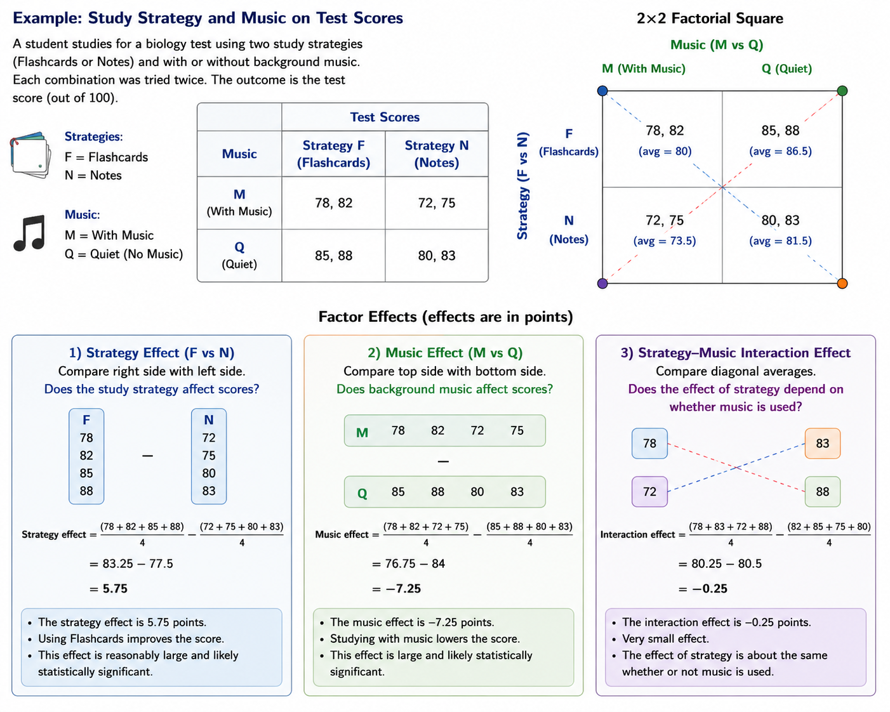
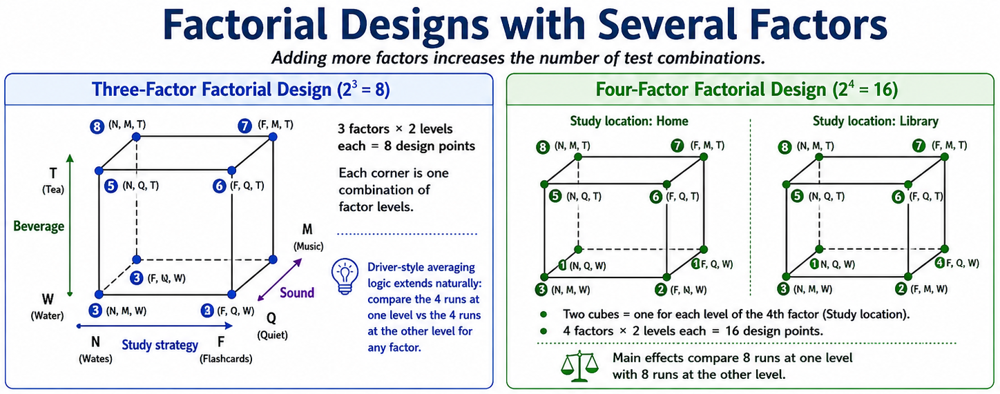
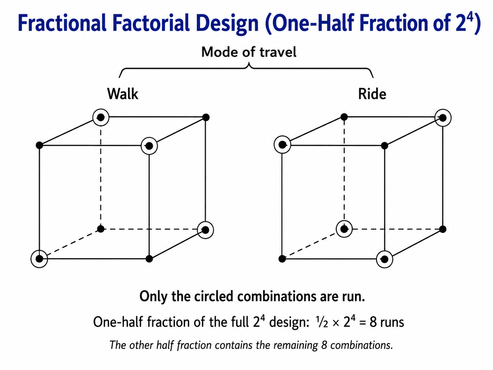

# Basic Principles of DOE and Factorial Designs

The basic principles of designed experiments were developed by Fisher from practical experimental work, especially agricultural field trials at Rothamsted in England.

The three basic principles are:

Randomization

Randomization means running the individual trials in an experiment in random order.

If trials are run in a systematic order, another unknown factor may change over time during the experiment. This unknown factor is sometimes called a **lurking variable**.

If the lurking variable changes at the same time as the factor being studied, the effect of the studied factor becomes confused with the lurking variable.

Randomization helps balance out the effects of unknown or uncontrolled variables.

Replication

Replication means repeating experimental conditions so that there is enough information to estimate experimental error and detect real effects.

Replication is connected to sample size.

The goal is to choose a sample size that gives an adequate probability of detecting an effect size that has practical value.

Blocking

Blocking is a technique for dealing with **nuisance factors**.

A nuisance factor is not the main factor of interest, but it may still affect the response.

## Strategy of Experimentation

There are several common ways people run experiments.

- Best-guess experiments (sometimes magically works)
- One-factor-at-a-time experiments (may work in simple cases)
- Statistically designed experiments (based on Fisher's factorial concept to study all factors together)

## Factorial Designs

In a factorial experiment, **all possible combinations** of factor levels are tested to see if they are independent or not.

2x2 factorial square example

4x4 factorial cubic example

### Curse of Dimensionality

- As more factors are added, the number of test combinations grows quickly.
- For a two-level factorial design, *number of combinations* is $2^k$, where $k$ is the number of factors.

### Fractional Factorial Design

It is still possible to, for example, investigate four factors in 8 runs by using a **fractional factorial design**. In many ways, the two half fractions are equivalent.

The benefit is that the experimenter can still learn a lot about:

- The main effects of the four factors
- Possible interactions between pairs of factors

Example of fractional design

## Planning, Conducting, and Analyzing Experiments

1. Recognize and state the problem

- Define the objective clearly.
- Make sure all problem owners agree on what the experiment should accomplish.

2. Choose factors, levels, and ranges

- Decide which factors to study, which are nuisance factors, and which can be ignored.
- Choose a small number of levels, usually 2 or 3.
- Use ranges large enough to reveal real effects, but not so extreme that they create unsafe or unrealistic conditions.
- Do this as a team; do not let one expert design a narrow experiment around a preconceived answer.

3. Select the response variable

- Decide what outcome will be measured and how it will be measured.
- Check whether special instruments, analysis, or calibration are needed.
- Steps 1-3 are **pre-experimental planning**, and spend most of the time on them.

4. Choose the experimental design

- Select the design after the problem, factors, levels, ranges, and response are clear.
- Modern software, such as JMP, can help choose and analyze designs.

5. Run the experiment

- Follow the randomized run order.
- Verify all factor settings before each run.
- Be present if possible: watch, ask questions, and make sure the experiment is run correctly.
- Common failures include destroying randomization or forgetting to reset factor levels.

6. Analyze the data

- Software makes analysis easier, but only if the experiment was planned and run correctly.
- Statistics cannot rescue a badly executed experiment.

7. Draw conclusions and make recommendations

- Convert the analysis into practical conclusions.
- Use clear graphs; one good graph can communicate results better than many ANOVA tables.

