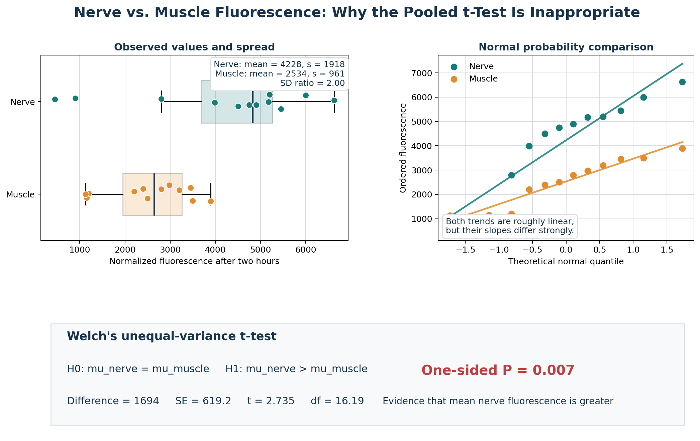
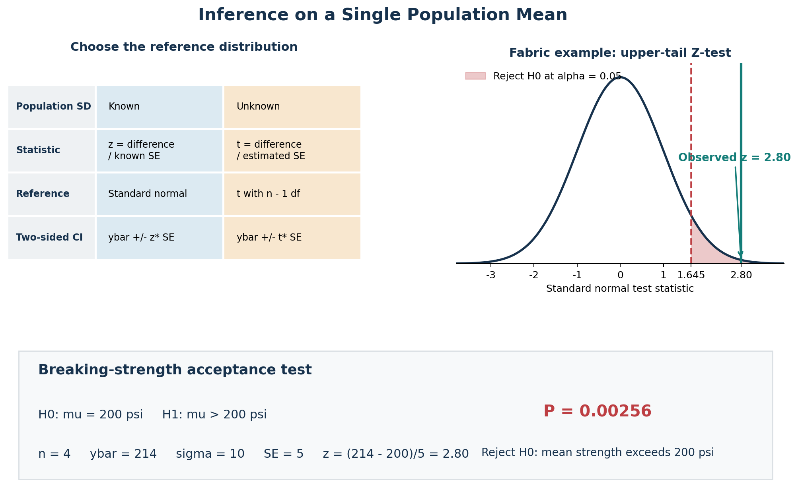

# Comparing Two Treatments

- Compare two conditions, treatments, recipes, methods, or processes.
- Decide whether the sample difference suggests a real population difference.
- Use **statistical hypothesis testing** as the analysis framework.
- Use a **two-sample t-test** for independent groups and a **paired t-test** for matched observations.
- Choose the pooled or Welch version of the independent two-sample test according to the variance assumptions.
- Use confidence intervals to describe the size and uncertainty of the estimated difference.

## Basic Visualization

> How sample data describe a larger population?

A **sample** is a smaller set of *observations* taken from a larger *population*.

Sample data can be summarized numerically with:

- The **sample mean**, or sample average
- The **sample variance**
- The **sample standard deviation**

These summaries describe the center and spread of the observed data. While we may have same parameters for **population**.

[Graphical summaries: sample vs. population](review_basic_statistics.ipynb)

Graphical summaries help reveal center, spread, and shape.
- Box plots summarize data using (25th and 75th) percentiles, medians, and whiskers (min and max).
- For small samples, dot diagrams or stem-and-leaf plots are usually easier to read than histograms.

## Representative Example With Hypothesis Testing

[Example: Portland cement visual comparison](portland_cement_example.ipynb)

> Is there statistical evidence that the mean tension bond strength is the same for the two mortar recipes?

This question leads into the **two-sample t-test** as a method of **statistical hypothesis testing**.

### Sampling Situation

The hypothesis-testing picture starts with two probability distributions:

- Population 1: measurements from factor level 1, or treatment 1.
- Population 2: measurements from factor level 2, or treatment 2.
- In the Portland cement problem, the two populations represent the two mortar formulations.

Assumptions:

- Observations from population 1 and 2 are normally distributed.
- Population 1 has mean $\mu_1$ and variance $\sigma_1^2$.
- Population 2 has mean $\mu_2$ and variance $\sigma_2^2$.

### Hypotheses

The claim being investigated is that the two population means are the same.

The hypotheses are:

$$
H_0: \mu_1 = \mu_2
$$

$$
H_1: \mu_1 \ne \mu_2
$$

- $H_0$ is the **null hypothesis**.
- $H_0$ says the two means are equal.
- $H_1$ is the **alternative hypothesis**.
- $H_1$ says the two means are not the same.

## Mortar Summary Statistics

Each population has:

- A mean $\mu$
- A variance $\sigma^2$

These are estimated with sample statistics.

### Sample Mean

The sample average $\bar{y}$ estimates the population mean $\mu$:

$$
\bar{y} = \frac{\sum_{i=1}^{n} y_i}{n}
$$

### Sample Variance

The sample variance estimates the population variance $\sigma^2$:

$$
s^2 = \frac{\sum_{i=1}^{n}(y_i - \bar{y})^2}{n - 1}
$$

### Results for the Mortar Data

The standard deviations are not exactly the same, but they are fairly close.

This agrees with the earlier dot diagrams and stem-and-leaf plots:

- The sample means looked noticeably different.
- The sample spreads looked fairly similar.
- The summary statistics reflect the same pattern.

### Test Statistic Idea

The two-sample t-test is used to test:

$$
H_0: \mu_1 = \mu_2
$$

The procedure uses the sample means to draw conclusions about the population means.

The key quantity is the difference in sample means, e.g.:

$$
\bar{y}_1 - \bar{y}_2 = -0.28
$$

The test divides the difference in sample means by the standard deviation of that difference.

This ratio measures how different the sample means are in **standard deviation units**.

### Standard Deviation of a Sample Mean

For one sample mean:

$$
\sigma_{\bar{y}}^2 = \frac{\sigma^2}{n}
$$

That is, the variance of the sample average is the variance of an individual observation divided by the sample size.

### Standard Deviation of the Difference in Sample Means

For two independent sample means:

$$
\sigma_{\bar{y}_1 - \bar{y}_2}^2 =
\frac{\sigma_1^2}{n_1}
+
\frac{\sigma_2^2}{n_2}
$$

The independence assumption is reasonable here because:

- The two samples are completely different samples.
- They were generated at different times.
- They are random samples.
- The treatments were applied essentially in random sequence.

### Known-Variance Statistic

If the variances were known, the statistic would be:

$$
z_0 =
\frac{\bar{y}_1 - \bar{y}_2}
{\sqrt{\sigma_1^2/n_1 + \sigma_2^2/n_2}}
$$

- The numerator is the difference in sample averages.
- The denominator is the standard deviation of the difference in sample means.
- If $\sigma_1^2$ and $\sigma_2^2$ were known, $z_0$ would follow a normal distribution.
- If $\mu_1 = \mu_2$, then $z_0$ would follow a standard normal distribution with mean 0 and variance 1.

### Fixed Significance Level Test

The question is how unusual, e.g., $z_0 = -2.09$, would be if the two population means were really equal.

If $H_0$ is true, then $z_0$ has a standard normal distribution.

For a standard normal distribution:

- 95% of the probability lies between $-1.96$ and $+1.96$.
- $+1.96$ is the upper 2.5% point of the standard normal distribution.
- It is denoted $z_{0.025}$.
- $-1.96$ is the lower 2.5% point.

So, if the population means are equal:

- Most observed $z_0$ values should fall between $-1.96$ and $+1.96$.
- A value like $z_0 = -2.09$ is unusual.
- It would occur less than 5% of the time if the population means were equal.
- This is evidence that the population means may not be equal.

A statistician would say:

- Reject the null hypothesis at the 5% level of significance.
- The result is a fairly strong indication that the two means are not equal.

This is a **fixed significance level test** because:

- The test statistic is compared with a **critical value**.
- The critical value, here 1.96, is selected in advance before running the experiment.
- The standard normal distribution is the **reference distribution** for this known-variance test.

### P-Value: Alternative Approach

Another common approach is the **P-value approach**.

- The P-value is the smallest significance level at which the observed result would lead to rejection of $H_0$.
- It measures how incompatible the observed test statistic is with $H_0$.
- For the Z-test, the P-value is easy to find from the standard normal distribution.

For the Portland cement example, the observed statistic is:

$$
z_0=-2.09
$$

Because the standard normal table contains areas to the left of positive $z$ values, use the absolute value:

$$
|z_0|=2.09
$$

The table gives:

$$
P(Z\leq 2.09)=\Phi(2.09)=0.98169
$$

Therefore, the area in the upper tail is:

$$
P(Z>2.09)=1-0.98169=0.01831
$$

The alternative hypothesis is two-sided, so equally extreme results in both tails must be counted:

$$
\text{P-value}
=2P(Z>|z_0|)
=2(0.01831)
=0.03662
$$

The decision rule is:

- Reject $H_0$ when $\text{P-value}\leq\alpha$.
- Fail to reject $H_0$ when $\text{P-value}>\alpha$.

At the usual $\alpha=0.05$ level:

$$
0.03662<0.05
$$

Therefore, reject $H_0$. The data provide evidence that the two mortar formulations have different mean tension bond strengths.

The same result would be obtained for any selected significance level $\alpha\geq0.03662$, but not for a stricter level such as $\alpha=0.01$.

> **Interpretation caution:** A P-value of 0.03662 is not the probability that $H_0$ is true. It is the probability, assuming $H_0$ is true, of observing a test statistic at least as extreme as the one calculated.

### Choosing the Significance Level

The significance level $\alpha$ is selected according to the context and the consequences of an incorrect conclusion.

- $\alpha=0.05$ is common in science and engineering, but it is not a universal or magical cut-off.
- Smaller values, such as 0.01 or 0.02, demand stronger evidence before rejecting $H_0$.
- Larger values, such as 0.10 or 0.15, may be considered during early exploratory experiments when missing a potentially important factor would be costly.

The significance level controls the probability of a **Type I error**:

$$
\text{Type I error: reject }H_0\text{ when }H_0\text{ is actually true}
$$

In factor-screening language, a Type I error means calling a factor important when it is not. The opposite error is:

$$
\text{Type II error: fail to reject }H_0\text{ when }H_1\text{ is actually true}
$$

During early discovery work, a Type II error can cause a genuinely important factor to be discarded and ignored in later experiments. This trade-off is why the choice of $\alpha$ should depend on the purpose of the study.

## From the Z-Test to the Two-Sample t-Test

The known-variance Z-test works directly when the population variances $\sigma_1^2$ and $\sigma_2^2$ are known. In practice, they usually are not known.

### Large-Sample Approximation

One possibility is to replace the unknown population variances with the sample variances:

$$
z_0\approx
\frac{\bar{y}_1-\bar{y}_2}
{\sqrt{s_1^2/n_1+s_2^2/n_2}}
$$

This normal approximation generally works reasonably well when both sample sizes are large, commonly at least 30 and sometimes conservatively taken as 40.

For small samples, however, estimating the population variances adds uncertainty. The standard normal distribution is no longer the appropriate reference distribution. This is the problem addressed by Student's t-distribution.

### Equal-Variance Assumption

For the pooled two-sample t-test, assume:

- The two samples are independent random samples.
- Each population is normally distributed.
- The two population variances are unknown but equal:

$$
\sigma_1^2=\sigma_2^2=\sigma^2
$$

Because the variances are assumed equal, the two sample variances can be combined into one estimate.

### Pooled Estimate of Variance

The pooled variance is a degrees-of-freedom-weighted average of the two sample variances:

$$
s_p^2=
\frac{(n_1-1)s_1^2+(n_2-1)s_2^2}
{n_1+n_2-2}
$$

Its positive square root, $s_p$, is the pooled standard deviation.

### Pooled Two-Sample t-Statistic

Substituting the pooled standard deviation into the standardized difference gives:

$$
t_0=
\frac{\bar{y}_1-\bar{y}_2}
{s_p\sqrt{1/n_1+1/n_2}}
$$

When $H_0:\mu_1=\mu_2$ is true, this statistic follows a t-distribution with:

$$
\nu=n_1+n_2-2
$$

degrees of freedom.

Like $z_0$, the statistic $t_0$ is a distance measure:

- Values near zero are consistent with $H_0$.
- Values far from zero support $H_1$.
- The statistic measures the difference between the sample means in estimated standard-error units.

It can also be interpreted as a signal-to-noise ratio:

$$
t_0=
\frac{\text{signal: difference in sample means}}
{\text{noise: estimated standard error of the difference}}
$$

## Portland Cement Pooled t-Test

For the two mortar samples:

$$
n_1=n_2=10
$$

The pooled variance and pooled standard deviation are:

$$
s_p^2=0.081
$$

$$
s_p=\sqrt{0.081}=0.284
$$

Substitution into the pooled t-statistic gives:

$$
t_0=-2.20
$$

Thus, the two sample means are a little more than two estimated standard errors apart.

### Reference Distribution and Degrees of Freedom

The number of degrees of freedom is:

$$
\nu=n_1+n_2-2=10+10-2=18
$$

The t-distribution is symmetric around zero, like the standard normal distribution, but has heavier tails. Its exact shape depends on the degrees of freedom. The heavier tails account for the extra uncertainty caused by estimating the variance from small samples.

For a two-sided test with $\alpha=0.05$, place $\alpha/2=0.025$ in each tail. From the t-table:

$$
t_{0.025,18}=2.101
$$

Therefore, the non-rejection region is:

$$
-2.101\leq t_0\leq2.101
$$

and the rejection region is:

$$
t_0<-2.101
\quad\text{or}\quad
t_0>2.101
$$

Because:

$$
t_0=-2.20<-2.101
$$

the observed statistic lies in the lower rejection region. Therefore:

- Reject $H_0$ at the 5% significance level.
- Conclude that there is statistically significant evidence of a difference between the two population means.
- The t-test reaches the same practical conclusion as the earlier illustrative Z-test.

It is possible for $H_0$ to be true and for $t_0$ to fall outside the critical boundaries, but under $H_0$ this occurs only 5% of the time when the test assumptions hold. That probability is the test's Type I error rate.

### Fixed-Level and P-Value Decisions

The two approaches use the same evidence and give the same decision when the same $\alpha$ is used:

- **Fixed significance level:** Compare $|t_0|$ with the critical value $t_{\alpha/2,\nu}$. Reject $H_0$ when $|t_0|>t_{\alpha/2,\nu}$.
- **P-value:** Calculate the two-tail probability beyond $|t_0|$. Reject $H_0$ when $\text{P-value}\leq\alpha$.

## P-Value for the Pooled t-Test

For the Portland cement test:

$$
t_0=-2.20, \qquad \nu=18
$$

Because the alternative hypothesis is two-sided, the P-value includes both tails of the t-distribution:

$$
\text{P-value}
=P\left(|T_{18}|\geq|t_0|\right)
=2P\left(T_{18}\geq2.20\right)
$$

Statistical software gives the exact result:

$$
\text{P-value}\approx0.042
$$

Since $0.042<0.05$, reject $H_0$ at the 5% significance level. The result is statistically significant, although it would not be significant at the stricter 1% level.

> The P-value is not the probability that rejecting $H_0$ is wrong. It is the probability, assuming $H_0$ is true, of obtaining a test statistic at least as extreme as the observed statistic.

### Approximating the P-Value With a t-Table

Most t-tables list only selected positive t-values and their upper-tail probabilities. First use the absolute value:

$$
|t_0|=2.20
$$

In the row for 18 degrees of freedom, the observed value is bracketed by:

$$
t_{0.025,18}=2.101<2.20<2.552=t_{0.01,18}
$$

Therefore, the one-tail probability satisfies:

$$
0.01<P(T_{18}>2.20)<0.025
$$

Doubling both bounds for the two-sided test gives:

$$
0.02<\text{P-value}<0.05
$$

The exact software value, approximately 0.042, lies inside these bounds.

## Computer Two-Sample t-Test Output

The screenshots show output from Minitab and JMP. Both programs use the pooled standard deviation and produce the same inference, but they define the difference in opposite orders.

### Minitab

Minitab defines the difference as:

$$
\mu_{\text{modified}}-\mu_{\text{unmodified}}
$$

Its output reports:

- Modified mortar: $n_1=10$, $\bar{y}_1=16.764$, $s_1=0.316$, and $SE(\bar{y}_1)=0.100$.
- Unmodified mortar: $n_2=10$, $\bar{y}_2=17.042$, $s_2=0.248$, and $SE(\bar{y}_2)=0.078$.
- Estimated difference: $16.764-17.042=-0.278$.
- Pooled standard deviation: $s_p=0.2843$.
- Test statistic: $t_0=-2.19$.
- Degrees of freedom: $18$.
- Two-sided P-value: $0.042$.
- 95% confidence interval: $(-0.545073,-0.010927)$.

The software statistic differs slightly from the hand-calculated value $-2.20$ because the software retains more decimal places.

### JMP

JMP defines the difference in the reverse order:

$$
\mu_{\text{unmodified}}-\mu_{\text{modified}}
$$

Its output reports:

- Estimated difference: $0.278000$.
- Standard error of the difference: approximately $0.12712$.
- t-ratio: $2.186876$.
- Degrees of freedom: $18$.
- Two-sided P-value, shown as $\operatorname{Prob}>|t|$: $0.0422$.
- 95% confidence interval: $(0.010927,0.545073)$.

The positive JMP statistic and interval do not contradict Minitab. Reversing the subtraction changes every sign:

$$
\mu_{\text{unmodified}}-\mu_{\text{modified}}
=-\left(\mu_{\text{modified}}-\mu_{\text{unmodified}}\right)
$$

The absolute t-value, two-sided P-value, and hypothesis-test conclusion remain the same.

## Checking the Pooled t-Test Assumptions

The pooled two-sample t-test assumes:

- The observations are independent.
- Each population is approximately normal.
- The two populations have equal variances.

### Normal Probability Plots

A normal probability plot can be drawn for each mortar sample.

- Data that lie approximately along a straight line provide reasonable evidence for normality.
- Both Portland cement samples follow approximately straight lines, so the normality assumption appears reasonable.
- The slope of a fitted line on a normal probability plot is proportional to the sample standard deviation.
- Similar slopes for the two samples support the equal-variance assumption.
- When judging straightness and slope by eye, emphasize the central part of the plot. A few tail observations can vary substantially in small samples.

### Importance of the Assumptions

The t-test is fairly robust to moderate departures from normality. It generally performs well when the population distributions are reasonably symmetric and unimodal.

The equal-variance assumption is more important for the pooled test. Substantially unequal variances can reduce the test's sensitivity and affect its error rate. When equal variances are doubtful, Welch's two-sample t-test is generally the appropriate alternative because it does not pool the variances.

## Why the t-Test Is Useful

For a simple comparative experiment, the t-test provides an objective rule for deciding whether an observed difference is larger than would reasonably be expected from random variation alone.

The method is versatile. For example, the effects in a two-level factorial design can be viewed as comparisons between mean responses on opposite sides of the experimental cube. Later procedures analyze all such effects more efficiently than running a separate t-test for each comparison.

A hypothesis test answers whether there is evidence of a difference, but it does not describe the likely size of that difference. A confidence interval supplies that additional information.

## Confidence Intervals

A confidence interval for a parameter $\theta$ has lower and upper limits $L$ and $U$:

$$
L\leq\theta\leq U
$$

The confidence procedure is constructed to have coverage probability:

$$
P(L\leq\theta\leq U)=1-\alpha
$$

Thus, a $100(1-\alpha)\%$ confidence procedure produces intervals that contain the true parameter in $100(1-\alpha)\%$ of repeated samples.

> For one interval already calculated, the parameter is fixed and the endpoints are random. A 95% confidence level describes the long-run success rate of the method, not a 95% posterior probability that this particular interval contains the parameter.

### Confidence Interval for the Difference in Two Means

Under the same assumptions as the pooled t-test, the $100(1-\alpha)\%$ confidence interval for $\mu_1-\mu_2$ is:

$$
(\bar{y}_1-\bar{y}_2)
\pm
t_{\alpha/2,n_1+n_2-2}
s_p\sqrt{\frac{1}{n_1}+\frac{1}{n_2}}
$$

Equivalently, the lower confidence limit is:

$$
L=(\bar{y}_1-\bar{y}_2)
-t_{\alpha/2,n_1+n_2-2}
s_p\sqrt{\frac{1}{n_1}+\frac{1}{n_2}}
$$

and the upper confidence limit is:

$$
U=(\bar{y}_1-\bar{y}_2)
+t_{\alpha/2,n_1+n_2-2}
s_p\sqrt{\frac{1}{n_1}+\frac{1}{n_2}}
$$

This has the familiar form:

$$
\text{point estimate}\pm\text{margin of error}
$$

where:

$$
\text{margin of error}
=t_{\alpha/2,n_1+n_2-2}
s_p\sqrt{\frac{1}{n_1}+\frac{1}{n_2}}
$$

## Portland Cement 95% Confidence Interval

Define the difference in the same order as Minitab:

$$
\mu_1-\mu_2
=\mu_{\text{modified}}-\mu_{\text{unmodified}}
$$

The required values are:

- $\bar{y}_1-\bar{y}_2=16.764-17.042=-0.278$.
- $s_p=0.2843$.
- $n_1=n_2=10$.
- $\nu=18$.
- $t_{0.025,18}=2.101$ for 95% confidence.

The estimated standard error is:

$$
SE(\bar{y}_1-\bar{y}_2)
=0.2843\sqrt{\frac{1}{10}+\frac{1}{10}}
\approx0.1271
$$

The margin of error is:

$$
2.101(0.1271)\approx0.267\approx0.27
$$

Therefore:

$$
\mu_1-\mu_2
=-0.278\pm0.267
$$

Using the full-precision software values gives:

$$
-0.545073
\leq
\mu_1-\mu_2
\leq
-0.010927
$$

Rounded as in the lecture and textbook:

$$
-0.55
\leq
\mu_1-\mu_2
\leq
-0.01
\quad\text{kgf/cm}^2
$$

### Interpretation

- The entire interval is negative because the modified-minus-unmodified mean difference is negative.
- The data estimate that modified mortar has a mean tension bond strength between $0.01$ and $0.55\ \text{kgf/cm}^2$ lower than unmodified mortar.
- Equivalently, unmodified mortar has a mean strength between $0.01$ and $0.55\ \text{kgf/cm}^2$ higher than modified mortar.
- The point estimate of the difference is $-0.278\ \text{kgf/cm}^2$, with a margin of error of approximately $0.27\ \text{kgf/cm}^2$.

### Connection With the Hypothesis Test

For the two-sided test:

$$
H_0:\mu_1-\mu_2=0
$$

At matching levels, a two-sided hypothesis test with significance $\alpha$ and a $100(1-\alpha)\%$ confidence interval give equivalent decisions:

- If the confidence interval excludes zero, reject $H_0$.
- If the confidence interval includes zero, fail to reject $H_0$.

Here, the 95% confidence interval $(-0.545073,-0.010927)$ excludes zero. This agrees with the two-sided t-test result, $P\approx0.042<0.05$, so $H_0$ is rejected.

## When the Two Population Variances Differ

The pooled two-sample t-test assumes that the two unknown population variances are equal. When the sample spreads are substantially different, pooling them into one variance estimate is not appropriate.

The usual alternative is **Welch's two-sample t-test**. Welch's test keeps the two sample variances separate and adjusts the reference distribution's degrees of freedom.

It assumes:

- The two samples are independent random samples.
- Observations within each sample are independent.
- Each population is approximately normal, particularly when the samples are small.
- The population variances do **not** have to be equal.

### Welch Test Statistic

For a hypothesized difference $\Delta_0$, test:

$$
H_0:\mu_1-\mu_2=\Delta_0
$$

with the statistic:

$$
t_0=
\frac{(\bar{y}_1-\bar{y}_2)-\Delta_0}
{\sqrt{s_1^2/n_1+s_2^2/n_2}}
$$

For the usual null hypothesis of equal means, $\Delta_0=0$:

$$
t_0=
\frac{\bar{y}_1-\bar{y}_2}
{\sqrt{s_1^2/n_1+s_2^2/n_2}}
$$

Unlike the pooled statistic, this statistic does not have an exact t-distribution. Its distribution is well approximated by a t-distribution using the **Welch-Satterthwaite degrees of freedom**:

$$
\nu=
\frac{
\left(\dfrac{s_1^2}{n_1}+\dfrac{s_2^2}{n_2}\right)^2
}
{
\dfrac{(s_1^2/n_1)^2}{n_1-1}
+
\dfrac{(s_2^2/n_2)^2}{n_2-1}
}
$$

Software normally uses the fractional value of $\nu$. When only an integer-row t-table is available, rounding $\nu$ down is a conservative approximation.

### Confidence Interval With Unequal Variances

The $100(1-\alpha)\%$ two-sided confidence interval for $\mu_1-\mu_2$ is:

$$
(\bar{y}_1-\bar{y}_2)
\pm
t_{\alpha/2,\nu}
\sqrt{\frac{s_1^2}{n_1}+\frac{s_2^2}{n_2}}
$$

The same Welch standard error and adjusted degrees of freedom are used for both the hypothesis test and the interval.

## Nerve and Muscle Fluorescence Example

Accidental nerve injury during surgery can cause pain, numbness, or paralysis. The study described in the lecture used a fluorescently labeled peptide that binds to nerves, potentially making nerves easier for surgeons to identify.

Normalized fluorescence after two hours was recorded for nerve and muscle tissue. The lecture data, read from a graph in the original paper, are:

| Observation | Nerve | Muscle |
| ---: | ---: | ---: |
| 1 | 6625 | 3900 |
| 2 | 6000 | 3500 |
| 3 | 5450 | 3450 |
| 4 | 5200 | 3200 |
| 5 | 5175 | 2980 |
| 6 | 4900 | 2800 |
| 7 | 4750 | 2500 |
| 8 | 4500 | 2400 |
| 9 | 3985 | 2200 |
| 10 | 900 | 1200 |
| 11 | 450 | 1150 |
| 12 | 2800 | 1130 |

The sample summaries are:

| Tissue | $n$ | Mean | Standard deviation | Minimum | Median | Maximum |
| --- | ---: | ---: | ---: | ---: | ---: | ---: |
| Nerve | 12 | 4228 | 1918 | 450 | 4825 | 6625 |
| Muscle/non-nerve | 12 | 2534 | 961 | 1130 | 2650 | 3900 |

The sample standard deviation for nerve tissue is about twice the muscle standard deviation:

$$
\frac{s_{\text{nerve}}}{s_{\text{muscle}}}
=\frac{1918}{961}
\approx2.00
$$

The normal probability plots are approximately linear, so normality is not the main concern. Their very different slopes indicate very different standard deviations, making the pooled t-test unsuitable.



### Hypotheses

Let $\mu_1$ be mean normalized fluorescence for nerve tissue and $\mu_2$ be the mean for muscle tissue. The research question is one-sided:

$$
H_0:\mu_1=\mu_2
$$

$$
H_1:\mu_1>\mu_2
$$

### Welch Test Calculation

The estimated mean difference is:

$$
\bar{y}_1-\bar{y}_2=4228-2534=1694
$$

The estimated standard error is:

$$
SE=
\sqrt{\frac{1918^2}{12}+\frac{961^2}{12}}
=619.29
$$

Therefore:

$$
t_0=
\frac{4228-2534}
{\sqrt{1918^2/12+961^2/12}}
=2.7354
$$

The Welch-Satterthwaite degrees of freedom are:

$$
\nu=
\frac{
\left(1918^2/12+961^2/12\right)^2
}
{
\dfrac{(1918^2/12)^2}{11}
+
\dfrac{(961^2/12)^2}{11}
}
=16.1955
$$

For hand calculation with a t-table, use $\nu=16$. The software output reports:

- Estimated difference: $1694$.
- Test statistic: $t_0\approx2.74$.
- Degrees of freedom: approximately $16$.
- One-sided P-value: $0.007$.
- 95% lower confidence bound for $\mu_1-\mu_2$: approximately $613$.

Because $0.007<0.05$, reject $H_0$. There is strong evidence that mean normalized fluorescence is greater for nerve tissue than for muscle tissue.

## Inference on a Single Mean

Some experiments compare one population mean $\mu$ with a specified or target value $\mu_0$. The target may come from previous evidence, a scientific model, an engineering specification, or a contract.

For a two-sided question, the hypotheses are:

$$
H_0:\mu=\mu_0
$$

$$
H_1:\mu\ne\mu_0
$$

The procedure depends on whether the population standard deviation $\sigma$ is known.

| Population variance | Test | Statistic | Reference distribution |
| --- | --- | --- | --- |
| $\sigma^2$ known | One-sample Z-test | $z_0=(\bar{y}-\mu_0)/(\sigma/\sqrt{n})$ | Standard normal $N(0,1)$ |
| $\sigma^2$ unknown | One-sample t-test | $t_0=(\bar{y}-\mu_0)/(s/\sqrt{n})$ | t-distribution with $n-1$ degrees of freedom |

### One-Sample Z-Test: Variance Known

When $\sigma$ is known:

$$
z_0=
\frac{\bar{y}-\mu_0}{\sigma/\sqrt{n}}
$$

If $H_0$ is true, then $Z_0\sim N(0,1)$. For a two-sided alternative, reject $H_0$ when:

$$
|z_0|>z_{\alpha/2}
$$

The $100(1-\alpha)\%$ confidence interval for $\mu$ is:

$$
\bar{y}
-z_{\alpha/2}\frac{\sigma}{\sqrt{n}}
\leq\mu\leq
\bar{y}
+z_{\alpha/2}\frac{\sigma}{\sqrt{n}}
$$

or, more compactly:

$$
\bar{y}\pm z_{\alpha/2}\frac{\sigma}{\sqrt{n}}
$$

## Fabric Breaking-Strength Example

A textile manufacturer will accept a fabric lot only if there is evidence that its mean breaking strength exceeds $200$ psi. Past experience supports a known population variance of:

$$
\sigma^2=100\ \text{psi}^2
$$

so:

$$
\sigma=10\ \text{psi}
$$

The upper-tail hypotheses are:

$$
H_0:\mu=200
$$

$$
H_1:\mu>200
$$

Four randomly selected specimens give:

$$
n=4,
\qquad
\bar{y}=214\ \text{psi}
$$

The Z statistic is:

$$
z_0=
\frac{214-200}{10/\sqrt{4}}
=\frac{14}{5}
=2.80
$$



For an upper-tail test with $\alpha=0.05$:

$$
z_{0.05}=1.645
$$

Since:

$$
2.80>1.645
$$

the observed statistic is in the rejection region. The one-sided P-value is:

$$
P(Z\geq2.80)
=1-\Phi(2.80)
=1-0.99744
=0.00256
$$

Do not double this probability because the alternative hypothesis is one-sided. Since $0.00256<0.05$, reject $H_0$ and conclude that the data provide strong evidence that the lot's mean breaking strength exceeds $200$ psi.

### One-Sample t-Test: Variance Unknown

When the population variance is unknown, replace $\sigma$ with the sample standard deviation $s$:

$$
t_0=
\frac{\bar{y}-\mu_0}{s/\sqrt{n}}
$$

Under $H_0$, this statistic follows a t-distribution with:

$$
\nu=n-1
$$

degrees of freedom. For a two-sided alternative, reject $H_0$ when:

$$
|t_0|>t_{\alpha/2,n-1}
$$

The corresponding $100(1-\alpha)\%$ confidence interval is:

$$
\bar{y}
-t_{\alpha/2,n-1}\frac{s}{\sqrt{n}}
\leq\mu\leq
\bar{y}
+t_{\alpha/2,n-1}\frac{s}{\sqrt{n}}
$$

or:

$$
\bar{y}\pm t_{\alpha/2,n-1}\frac{s}{\sqrt{n}}
$$

For a small sample, this procedure assumes that the population is approximately normal. Moderate departures from normality usually do not seriously affect the result, but strong skewness or outliers require care.

### Choosing the Correct Tail

The alternative hypothesis determines the rejection region and P-value calculation:

| Alternative hypothesis | Test direction | P-value |
| --- | --- | --- |
| $H_1:\mu\ne\mu_0$ | Two-sided | Count both tails |
| $H_1:\mu>\mu_0$ | Upper-tailed | Count only the upper tail |
| $H_1:\mu<\mu_0$ | Lower-tailed | Count only the lower tail |

Choose the direction before examining the data. A one-sided test concentrates all of $\alpha$ in one tail and should be used only when effects in the opposite direction would not support the research claim.

## Paired Experiments and the Paired t-Test

The independent two-sample procedures above are appropriate when the observations in one group have no natural connection to observations in the other group. Some two-treatment experiments have a different structure: the two measurements are made on the **same experimental unit**, or units in the two groups are deliberately matched. These observations form pairs.

Examples include:

- Before-and-after measurements on the same person.
- Two instruments used on the same specimen.
- Two treatments applied to different portions of the same batch or material sample.
- Subjects matched by age, baseline condition, or another important characteristic.

Pairing can remove variability caused by differences among experimental units. The analysis therefore focuses on the **within-pair differences**, rather than treating the two sets of measurements as independent samples.

### Hardness-Testing Experiment

A Rockwell-type hardness tester presses a pointed tip into a metal specimen under a known force. The resulting indentation is used to determine relative hardness. The machine has two tips, and the experiment asks whether the tips produce different mean hardness readings.

One possible design would randomly assign 10 of 20 specimens to Tip 1 and the other 10 to Tip 2. This is a completely randomized, independent-samples design. However, specimens cut from different pieces of bar stock or produced in different heats may have different hardness. That specimen-to-specimen variation would enter the experimental error and could hide a real tip effect.

A paired design provides better control of this nuisance variation:

1. Select 10 specimens, each large enough for two hardness measurements.
2. Divide each specimen into two comparable portions.
3. Apply Tip 1 to one portion and Tip 2 to the other.
4. Randomize which portion receives each tip and randomize the testing order.

Each specimen is now a **block**, and the two tip readings within that specimen form a pair.

### Observed Paired Data

Define the difference consistently as:

$$
d_j=y_{1j}-y_{2j}
$$

where $y_{1j}$ and $y_{2j}$ are the Tip 1 and Tip 2 readings on specimen $j$.

| Specimen $j$ | Tip 1, $y_{1j}$ | Tip 2, $y_{2j}$ | Difference, $d_j=y_{1j}-y_{2j}$ |
| ---: | ---: | ---: | ---: |
| 1 | 7 | 6 | 1 |
| 2 | 3 | 3 | 0 |
| 3 | 3 | 5 | -2 |
| 4 | 4 | 3 | 1 |
| 5 | 8 | 8 | 0 |
| 6 | 3 | 2 | 1 |
| 7 | 2 | 4 | -2 |
| 8 | 9 | 9 | 0 |
| 9 | 5 | 4 | 1 |
| 10 | 4 | 5 | -1 |
| **Total** | **48** | **49** | **-1** |
| **Mean** | **4.80** | **4.90** | **-0.10** |

The signs depend on the chosen subtraction order. Had the differences been defined as Tip 2 minus Tip 1, the estimate and test statistic would change sign, but a two-sided P-value and the final decision would not change.

### Statistical Model and the Blocking Effect

A model for the response is:

$$
y_{ij}=\mu_i+\beta_j+\varepsilon_{ij},
\qquad
i=1,2,
\quad
j=1,2,\ldots,n
$$

where:

- $\mu_i$ is the mean response associated with tip $i$.
- $\beta_j$ is the effect of specimen, or block, $j$.
- $\varepsilon_{ij}$ is random measurement error, assumed independent with mean zero and common variance $\sigma^2$ in this model.

For the $j$th pair:

$$
d_j=y_{1j}-y_{2j}
$$

Taking its expected value gives:

$$
\begin{aligned}
\mu_d
=E(d_j)
&=E(y_{1j}-y_{2j})\\
&=E(y_{1j})-E(y_{2j})\\
&=(\mu_1+\beta_j)-(\mu_2+\beta_j)\\
&=\mu_1-\mu_2
\end{aligned}
$$

The specimen effect $\beta_j$ cancels because both tips are compared on the same specimen. Consequently, inference about $\mu_1-\mu_2$ can be based on the population mean of the differences, $\mu_d$.

This is the central benefit of pairing: comparison is made **within homogeneous blocks**, so variation between blocks does not obscure the treatment comparison.

### Hypotheses

Testing whether the two tips have the same mean is equivalent to testing whether the mean paired difference is zero:

$$
H_0:\mu_1=\mu_2
\quad\Longleftrightarrow\quad
H_0:\mu_d=0
$$

For a two-sided comparison:

$$
H_0:\mu_d=0
$$

$$
H_1:\mu_d\ne0
$$

More generally, a paired test may compare the mean difference with a nonzero reference value $\Delta_0$:

$$
H_0:\mu_d=\Delta_0
$$

### Paired t-Test Statistic

Once the differences have been calculated, the paired t-test is simply a **one-sample t-test applied to the $n$ differences**.

Their sample mean is:

$$
\bar{d}=\frac{1}{n}\sum_{j=1}^{n}d_j
$$

Their sample standard deviation is:

$$
S_d=
\sqrt{
\frac{\sum_{j=1}^{n}(d_j-\bar{d})^2}{n-1}
}
$$

An equivalent computational form is:

$$
S_d=
\sqrt{
\frac{
\displaystyle\sum_{j=1}^{n}d_j^2
-\dfrac{1}{n}\left(\displaystyle\sum_{j=1}^{n}d_j\right)^2
}{n-1}
}
$$

For $H_0:\mu_d=\Delta_0$, the test statistic is:

$$
t_0=
\frac{\bar{d}-\Delta_0}{S_d/\sqrt{n}}
$$

If the differences are normally distributed and $H_0$ is true, then $t_0$ follows a t-distribution with:

$$
\nu=n-1
$$

degrees of freedom. For the usual two-sided test at significance level $\alpha$, reject $H_0$ when:

$$
|t_0|>t_{\alpha/2,n-1}
$$

Equivalently, reject when the two-sided P-value is less than $\alpha$.

### Hardness-Test Calculation

For the 10 observed differences:

$$
\sum_{j=1}^{10}d_j=-1,
\qquad
\sum_{j=1}^{10}d_j^2=13
$$

Therefore:

$$
\bar{d}
=\frac{1}{10}\sum_{j=1}^{10}d_j
=\frac{-1}{10}
=-0.10
$$

and:

$$
\begin{aligned}
S_d
&=
\sqrt{
\frac{
13-\dfrac{1}{10}(-1)^2
}{10-1}
}\\
&=1.1972
\approx1.20
\end{aligned}
$$

The estimated standard error of $\bar d$ is:

$$
SE(\bar d)=\frac{S_d}{\sqrt n}
=\frac{1.1972}{\sqrt{10}}
=0.3786
$$

For $H_0:\mu_d=0$:

$$
t_0=
\frac{-0.10}{1.1972/\sqrt{10}}
=-0.264
\approx-0.26
$$

There are $10-1=9$ degrees of freedom. For a two-sided test with $\alpha=0.05$:

$$
t_{0.025,9}=2.262
$$

Since:

$$
|t_0|=0.264<2.262
$$

the statistic is not in the rejection region. The two-sided P-value is approximately $0.798$, which is also much larger than $0.05$. Therefore, **fail to reject $H_0$**. The experiment provides no statistically significant evidence that the two tips have different mean hardness readings.

Failing to reject $H_0$ does not prove that the tips are identical. It means that differences still compatible with the data cannot be ruled out. A confidence interval describes those plausible differences.

### Confidence Interval for the Mean Paired Difference

The $100(1-\alpha)\%$ confidence interval for $\mu_d=\mu_1-\mu_2$ is:

$$
\bar d
\pm
t_{\alpha/2,n-1}\frac{S_d}{\sqrt n}
$$

For the hardness data, the 95% interval is:

$$
\begin{aligned}
-0.10
&\pm
(2.262)\frac{1.1972}{\sqrt{10}}\\
&=-0.10\pm0.856\\
&\approx-0.10\pm0.86
\end{aligned}
$$

Thus:

$$
-0.956\leq\mu_1-\mu_2\leq0.756
$$

or, after rounding to two decimal places:

$$
(-0.96,\ 0.76)
$$

The interval includes zero, agreeing with the hypothesis-test decision. Here $0.86$ is the **margin of error**, or interval half-width; the total interval width is approximately $1.72$.

## Why Pairing Can Increase Precision

To see what is gained by pairing, suppose the same observations were incorrectly analyzed as two independent samples with equal variances. The sample means would still be:

$$
\bar y_1=4.80,
\qquad
\bar y_2=4.90,
\qquad
\bar y_1-\bar y_2=-0.10
$$

The separate sample variances and pooled standard deviation are approximately:

$$
s_1^2=5.733,
\qquad
s_2^2=4.989
$$

$$
S_p=
\sqrt{
\frac{(10-1)s_1^2+(10-1)s_2^2}{10+10-2}
}
=2.315
\approx2.32
$$

The independent-samples 95% confidence interval would be:

$$
(\bar y_1-\bar y_2)
\pm
t_{0.025,18}S_p
\sqrt{\frac{1}{n_1}+\frac{1}{n_2}}
$$

$$
\begin{aligned}
-0.10
&\pm
(2.101)(2.315)
\sqrt{\frac{1}{10}+\frac{1}{10}}\\
&=-0.10\pm2.18\\
&=(-2.28,\ 2.08)
\end{aligned}
$$

The point estimate remains $-0.10$, but the independent interval's margin of error is $2.18$, compared with only $0.86$ for the paired interval. It is approximately:

$$
\frac{2.18}{0.86}\approx2.5
$$

times as large.

| Analysis | Standard deviation used | Degrees of freedom | 95% interval | Margin of error |
| --- | ---: | ---: | ---: | ---: |
| Paired | $S_d\approx1.20$ | 9 | $(-0.96,0.76)$ | $0.86$ |
| Treating readings as independent | $S_p\approx2.32$ | 18 | $(-2.28,2.08)$ | $2.18$ |

The apparently larger number of degrees of freedom in the independent analysis does not compensate for its inflated variance estimate.

### Variance Explanation

Under the paired model, specimen effects contribute to the variation of readings across specimens. If the block effects are treated as fixed and centered around their mean, the expected pooled variance from an independent-samples analysis contains both measurement error and block variation:

$$
E(S_p^2)
=
\sigma^2
+
\frac{1}{n-1}
\sum_{j=1}^{n}(\beta_j-\bar\beta)^2
$$

With the common constraint $\bar\beta=0$, this becomes:

$
E(S_p^2)
=
\sigma^2
+
\frac{1}{n-1}
\sum_{j=1}^{n}\beta_j^2
$

The second term is nuisance variation among specimens. It inflates the error estimate when the blocking is ignored. In the paired differences, the block effect cancels, leaving the comparison to depend only on within-specimen variation. This is why blocking is called a **noise-reduction design technique**.

Another way to express the same idea is through within-pair correlation. If the two measurements have standard deviations $\sigma_1$ and $\sigma_2$ and correlation $\rho$, then:

```math
\mathrm{Var}(Y_1 - Y_2)
=
\sigma_1^2 + \sigma_2^2 - 2\rho\sigma_1\sigma_2
```

Good matching usually creates positive correlation, so the last term reduces the variance of the differences. Pairing provides little benefit when the match is weak and may be inefficient when the within-pair correlation is negative.

## Assumptions of the Paired t-Test

The paired t-test assumes:

- The data genuinely form meaningful pairs established by the design, not pairs created after examining the responses.
- Different pairs are independent of one another.
- The paired differences are a random sample from the population of relevant differences.
- The response is quantitative and the differences are approximately normally distributed when $n$ is small.
- The differences contain no severe outliers that dominate $\bar d$ and $S_d$.

Normality concerns the distribution of the **differences**, not the two sets of raw measurements separately. With a larger number of pairs, the procedure is reasonably robust to moderate nonnormality, but severe skewness and influential outliers still require investigation.

If normality of the differences is doubtful, useful alternatives may include a paired randomization test or the Wilcoxon signed-rank test, provided the assumptions of the selected alternative are appropriate.

